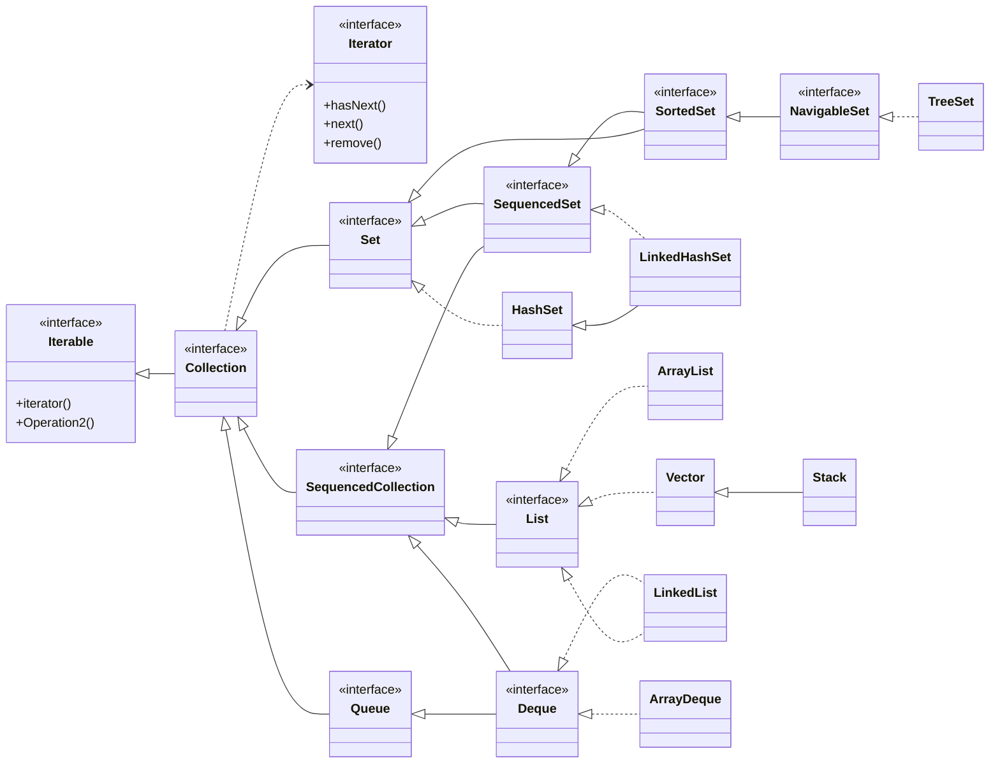

# Collection的继承结构

> 源文件：[[Collection的继承结构.mdj]]

```mermaid
classDiagram
    direction LR

    class Collection {
        <<interface>>
    }
    class Iterable {
        <<interface>>
        +iterator()
        +Operation2()
    }
    class Iterator {
        <<interface>>
        +hasNext()
        +next()
        +remove()
    }
    class Set {
        <<interface>>
    }
    class SequencedCollection {
        <<interface>>
    }
    class Queue {
        <<interface>>
    }
    class Deque {
        <<interface>>
    }
    class List {
        <<interface>>
    }
    class SequencedSet {
        <<interface>>
    }
    class SortedSet {
        <<interface>>
    }
    class HashSet
    class LinkedHashSet
    class NavigableSet {
        <<interface>>
    }
    class TreeSet
    class ArrayList
    class Vector
    class LinkedList
    class Stack
    class ArrayDeque

    Iterable <|-- Collection
    Collection ..> Iterator
    Collection <|-- Set
    Collection <|-- SequencedCollection
    Collection <|-- Queue
    Queue <|-- Deque
    SequencedCollection <|-- Deque
    SequencedCollection <|-- List
    SequencedCollection <|-- SequencedSet
    Set <|-- SequencedSet
    Set <|-- SortedSet
    SequencedSet <|-- SortedSet
    Set <|.. HashSet
    HashSet <|-- LinkedHashSet
    SequencedSet <|.. LinkedHashSet
    SortedSet <|-- NavigableSet
    NavigableSet <|.. TreeSet
    List <|.. ArrayList
    List <|.. Vector
    List <|.. LinkedList
    Deque <|.. LinkedList
    Vector <|-- Stack
    Deque <|.. ArrayDeque
```

