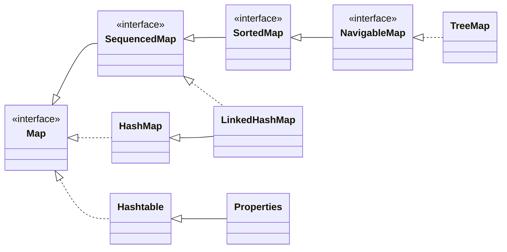

# Map继承结构

> 源文件：[[Map继承结构.mdj]]

```mermaid
classDiagram
    direction LR

    class Map {
        <<interface>>
    }
    class SequencedMap {
        <<interface>>
    }
    class SortedMap {
        <<interface>>
    }
    class NavigableMap {
        <<interface>>
    }
    class TreeMap
    class HashMap
    class LinkedHashMap
    class Hashtable
    class Properties

    Map <|-- SequencedMap
    SequencedMap <|-- SortedMap
    SortedMap <|-- NavigableMap
    NavigableMap <|.. TreeMap
    Map <|.. HashMap
    HashMap <|-- LinkedHashMap
    SequencedMap <|.. LinkedHashMap
    Map <|.. Hashtable
    Hashtable <|-- Properties
```

