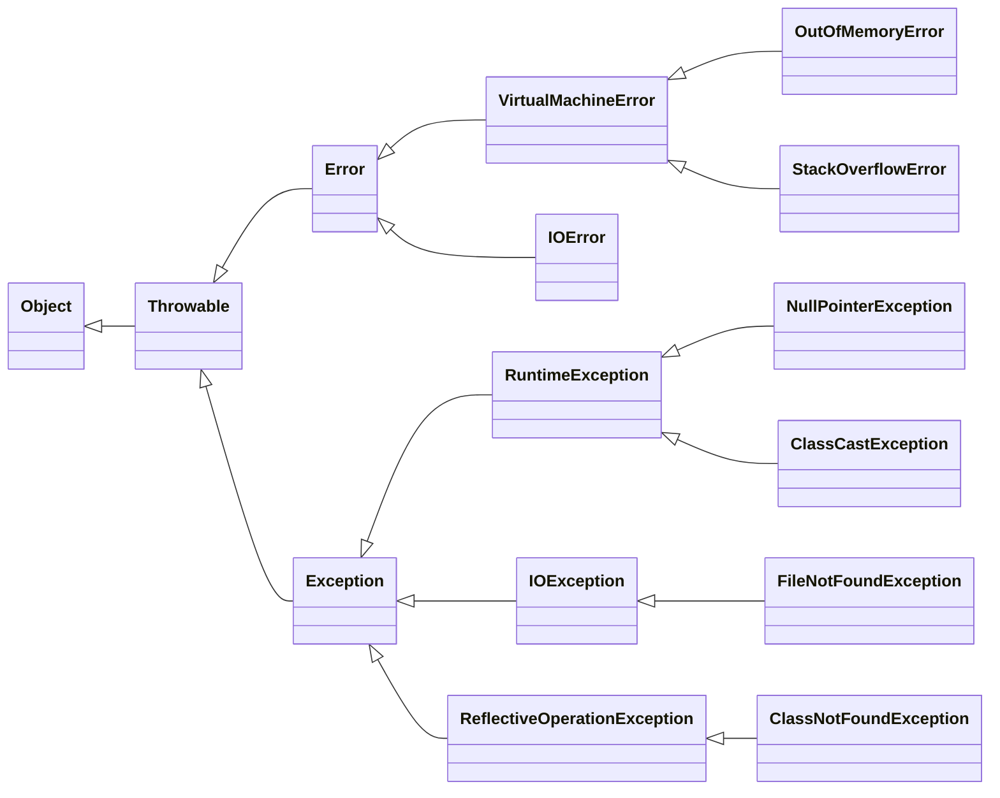

# 异常的继承结构

> 源文件：[[异常的继承结构.mdj]]

```mermaid
classDiagram
    direction LR

    class Object
    class Throwable
    class Error
    class Exception
    class VirtualMachineError
    class OutOfMemoryError
    class StackOverflowError
    class IOError
    class RuntimeException
    class NullPointerException
    class ClassCastException
    class IOException
    class FileNotFoundException
    class ReflectiveOperationException
    class ClassNotFoundException

    Object <|-- Throwable
    Throwable <|-- Error
    Throwable <|-- Exception
    Error <|-- VirtualMachineError
    VirtualMachineError <|-- OutOfMemoryError
    VirtualMachineError <|-- StackOverflowError
    Error <|-- IOError
    Exception <|-- RuntimeException
    RuntimeException <|-- NullPointerException
    RuntimeException <|-- ClassCastException
    Exception <|-- IOException
    IOException <|-- FileNotFoundException
    Exception <|-- ReflectiveOperationException
    ReflectiveOperationException <|-- ClassNotFoundException
```

