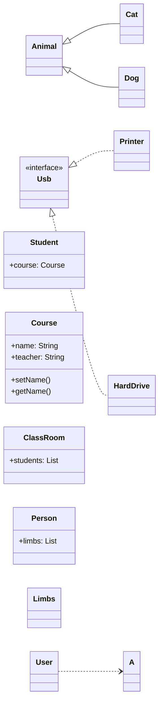

# 类与类之间的关系

> 源文件：[[类与类之间的关系.mdj]]

```mermaid
classDiagram
    direction LR

    class Animal
    class Cat
    class Dog
    class Usb {
        <<interface>>
    }
    class Printer
    class HardDrive
    class Student {
        +course: Course
    }
    class Course {
        +name: String
        +teacher: String
        +setName()
        +getName()
    }
    class ClassRoom {
        +students: List<Student>
    }
    class Person {
        +limbs: List<Limbs>
    }
    class Limbs
    class User
    class A

    Animal <|-- Cat
    Animal <|-- Dog
    Usb <|.. Printer
    Usb <|.. HardDrive
    User ..> A
```

