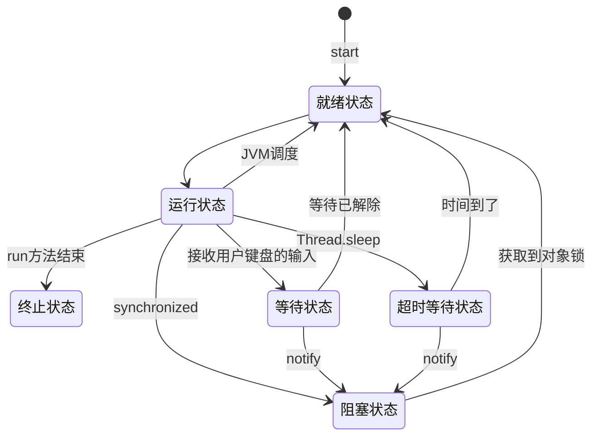

# 线程的生命周期

> 源文件：[[线程的生命周期.mdj]]

```mermaid
stateDiagram-v2

    state "终止状态" as s0
    state "就绪状态" as s1
    state "运行状态" as s2
    state "超时等待状态" as s3
    state "等待状态" as s4
    state "阻塞状态" as s5

    [*] --> s1 : start
    s1 --> s2
    s2 --> s1 : JVM调度
    s2 --> s3 : Thread.sleep
    s3 --> s1 : 时间到了
    s2 --> s0 : run方法结束
    s2 --> s4 : 接收用户键盘的输入
    s4 --> s1 : 等待已解除
    s2 --> s5 : synchronized
    s5 --> s1 : 获取到对象锁
    s4 --> s5 : notify
    s3 --> s5 : notify
```

