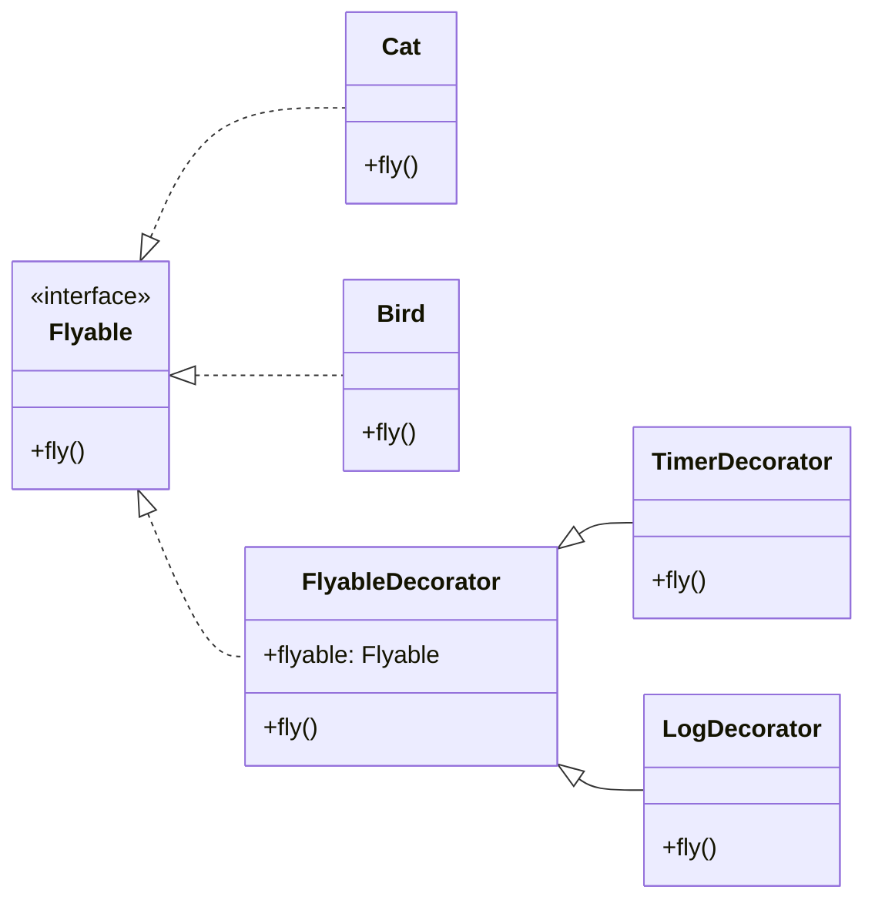

# 装饰器设计模式类图

> 源文件：[[装饰器设计模式类图.mdj]]

```mermaid
classDiagram
    direction LR

    class Flyable {
        <<interface>>
        +fly()
    }
    class Cat {
        +fly()
    }
    class Bird {
        +fly()
    }
    class FlyableDecorator {
        +flyable: Flyable
        +fly()
    }
    class TimerDecorator {
        +fly()
    }
    class LogDecorator {
        +fly()
    }

    Flyable <|.. Cat
    Flyable <|.. Bird
    Flyable <|.. FlyableDecorator
    FlyableDecorator <|-- TimerDecorator
    FlyableDecorator <|-- LogDecorator
```

