# 操作001：RabbitMQ安装

> 下一篇：[[Operation002-HelloWorld]]

## 一、安装

```shell
# 拉取镜像
docker pull rabbitmq:3.13-management

# -d 参数：后台运行 Docker 容器
# --name 参数：设置容器名称
# -p 参数：映射端口号，格式是“宿主机端口号:容器内端口号”。5672供客户端程序访问，15672供后台管理界面访问
# -v 参数：卷映射目录
# -e 参数：设置容器内的环境变量，这里我们设置了登录RabbitMQ管理后台的默认用户和密码
docker run -d \
--name rabbitmq \
-p 5672:5672 \
-p 15672:15672 \
-v rabbitmq-plugin:/plugins \
-e RABBITMQ_DEFAULT_USER=guest \
-e RABBITMQ_DEFAULT_PASS=123456 \
rabbitmq:3.13-management
```

## 二、验证

访问后台管理界面：http://192.168.200.100:15672


使用上面创建[[AngelByte_Note/09-Docker/Docker|Docker]]容器时指定的默认用户名、密码登录：


## 三、可能的问题

### 1、问题现象

在使用Docker拉取RabbitMQ镜像的时候，如果遇到提示：missing signature key，那就说明Docker版本太低了，需要升级

比如我目前的Docker版本如下图所示：

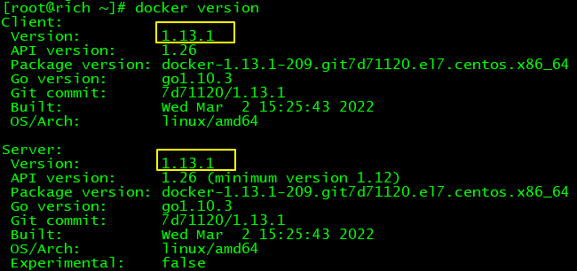

### 2、解决办法

> 基于CentOS7

#### ①卸载当前Docker

更好的办法是安装Docker前曾经给服务器拍摄了快照，此时恢复快照；

如果不曾拍摄快照，那只能执行卸载操作了

```shell
yum erase -y docker \
	docker-client \
	docker-client-latest \
	docker-common \
	docker-latest \
	docker-latest-logrotate \
	docker-logrotate \
	docker-selinux \
	docker-engine-selinux \
	docker-engine \
	docker-ce
```

#### ②升级yum库

```shell
yum update -y
```

#### ③安装Docker最新版

```shell
yum install -y docker-ce docker-ce-cli containerd.io docker-buildx-plugin docker-compose-plugin
```

如果这一步看到提示：没有可用软件包 docker-ce，那就添加Docker的yum源：

```shell
yum install -y yum-utils
yum-config-manager --add-repo https://download.docker.com/linux/centos/docker-ce.repo
```

#### ④设置Docker服务

```shell
systemctl start docker
systemctl enable docker
```

### 3、验证

上述操作执行完成后，再次查看Docker版本：

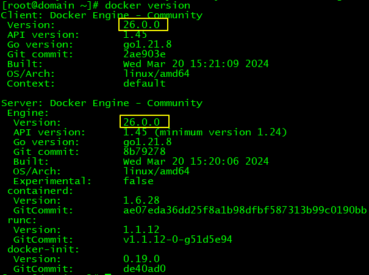


---

# 操作002：HelloWorld

> 上一篇：[[Operation001-Install]] · 下一篇：[[Operation003-WorkQueue]]

## 一、目标

生产者发送消息，消费者接收消息，用最简单的方式实现<br/>

官网说明参见下面超链接：<br/>

[RabbitMQ tutorial - "Hello World!" — RabbitMQ](https://www.rabbitmq.com/tutorials/tutorial-one-java.html)

![(P) -> [|||] -> (C)](assets\python-one.png)

## 二、具体操作

### 1、创建Java工程

#### ①消息发送端（生产者）


#### ②消息接收端（消费者）


#### ③添加依赖

```xml
<dependencies>
    <dependency>
        <groupId>com.rabbitmq</groupId>
        <artifactId>amqp-client</artifactId>
        <version>5.20.0</version>
    </dependency>
</dependencies>
```

### 2、发送消息

#### ①Java代码

不用客气，整个代码全部复制——当然，连接信息改成你自己的：

```java
package com.atguigu.rabbitmq.simple;  
  
import com.rabbitmq.client.Channel;  
import com.rabbitmq.client.Connection;  
import com.rabbitmq.client.ConnectionFactory;  
  
public class Producer {  
  
    public static void main(String[] args) throws Exception {  
  
        // 创建连接工厂  
        ConnectionFactory connectionFactory = new ConnectionFactory();  
  
        // 设置主机地址  
        connectionFactory.setHost("192.168.200.100");  
  
        // 设置连接端口号：默认为 5672
        connectionFactory.setPort(5672);
  
        // 虚拟主机名称：默认为 /
        connectionFactory.setVirtualHost("/");
  
        // 设置连接用户名；默认为guest  
        connectionFactory.setUsername("guest");
  
        // 设置连接密码；默认为guest  
        connectionFactory.setPassword("123456");
  
        // 创建连接  
        Connection connection = connectionFactory.newConnection();  
  
        // 创建频道  
        Channel channel = connection.createChannel();  
  
        // 声明（创建）队列  
        // queue      参数1：队列名称  
        // durable    参数2：是否定义持久化队列，当 MQ 重启之后还在  
        // exclusive  参数3：是否独占本次连接。若独占，只能有一个消费者监听这个队列且 Connection 关闭时删除这个队列  
        // autoDelete 参数4：是否在不使用的时候自动删除队列，也就是在没有Consumer时自动删除  
        // arguments  参数5：队列其它参数  
        channel.queueDeclare("simple_queue", true, false, false, null);  
  
        // 要发送的信息  
        String message = "你好；小兔子！";  
  
        // 参数1：交换机名称,如果没有指定则使用默认Default Exchange  
        // 参数2：路由key,简单模式可以传递队列名称  
        // 参数3：配置信息  
        // 参数4：消息内容  
        channel.basicPublish("", "simple_queue", null, message.getBytes());  
  
        System.out.println("已发送消息：" + message);  
  
        // 关闭资源  
        channel.close();  
        connection.close();  
  
    }  
  
}
```

#### ②查看效果


### 3、接收消息

#### ①Java代码

不用客气，整个代码全部复制——当然，连接信息改成你自己的：

```java
package com.atguigu.rabbitmq.simple;  
  
import com.rabbitmq.client.*;  
  
import java.io.IOException;  
  
public class Consumer {  
  
    public static void main(String[] args) throws Exception {  
  
        // 1.创建连接工厂  
        ConnectionFactory factory = new ConnectionFactory();  
  
        // 2. 设置参数  
        factory.setHost("192.168.200.100");  
        factory.setPort(5672);  
        factory.setVirtualHost("/");  
        factory.setUsername("guest");
        factory.setPassword("123456");  
  
        // 3. 创建连接 Connection        
        Connection connection = factory.newConnection();  
  
        // 4. 创建Channel  
        Channel channel = connection.createChannel();  
  
        // 5. 创建队列  
        // 如果没有一个名字叫simple_queue的队列，则会创建该队列，如果有则不会创建  
        // 参数1. queue：队列名称  
        // 参数2. durable：是否持久化。如果持久化，则当MQ重启之后还在  
        // 参数3. exclusive：是否独占。  
        // 参数4. autoDelete：是否自动删除。当没有Consumer时，自动删除掉  
        // 参数5. arguments：其它参数。  
        channel.queueDeclare("simple_queue",true,false,false,null);  
  
        // 接收消息  
        DefaultConsumer consumer = new DefaultConsumer(channel){  
  
            // 回调方法,当收到消息后，会自动执行该方法  
            // 参数1. consumerTag：标识  
            // 参数2. envelope：获取一些信息，交换机，路由key...  
            // 参数3. properties：配置信息  
            // 参数4. body：数据  
            @Override  
            public void handleDelivery(String consumerTag, Envelope envelope, AMQP.BasicProperties properties, byte[] body) throws IOException {  
  
                System.out.println("consumerTag："+consumerTag);  
                System.out.println("Exchange："+envelope.getExchange());  
                System.out.println("RoutingKey："+envelope.getRoutingKey());  
                System.out.println("properties："+properties);  
                System.out.println("body："+new String(body));  
  
            }  
  
        };  
  
        // 参数1. queue：队列名称  
        // 参数2. autoAck：是否自动确认，类似咱们发短信，发送成功会收到一个确认消息  
        // 参数3. callback：回调对象  
        // 消费者类似一个监听程序，主要是用来监听消息  
        channel.basicConsume("simple_queue",true,consumer);  
  
    }  
  
}
```

#### ②控制台打印

> consumerTag：amq.ctag-8EB87GaZFP52LKSMcj98UA
> Exchange：
> RoutingKey：simple_queue
> properties：#contentHeader<basic>(content-type=null, content-encoding=null, headers=null, delivery-mode=null, priority=null, correlation-id=null, reply-to=null, expiration=null, message-id=null, timestamp=null, type=null, user-id=null, app-id=null, cluster-id=null)
> body：<span style="color:blue;font-weight:bolder;">你好；小兔子！</span>

#### ③查看后台管理界面

因为消息被消费掉了，所以RabbitMQ服务器上没有了：


---

# 操作003：工作队列模式

> 上一篇：[[Operation002-HelloWorld]] · 下一篇：[[Operation004-PubSub]]

## 一、生产者代码
### 1、封装工具类

```java
package com.atguigu.rabbitmq.util;  
  
import com.rabbitmq.client.Connection;  
import com.rabbitmq.client.ConnectionFactory;  
  
public class ConnectionUtil {  
  
    public static final String HOST_ADDRESS = "192.168.200.100";  
  
    public static Connection getConnection() throws Exception {  
  
        // 定义连接工厂  
        ConnectionFactory factory = new ConnectionFactory();  
  
        // 设置服务地址  
        factory.setHost(HOST_ADDRESS);  
  
        // 端口  
        factory.setPort(5672);  
  
        //设置账号信息，用户名、密码、vhost  
        factory.setVirtualHost("/");  
        factory.setUsername("guest");  
        factory.setPassword("123456");  
  
        // 通过工程获取连接  
        Connection connection = factory.newConnection();  
  
        return connection;  
    }  
  
  
  
    public static void main(String[] args) throws Exception {  
  
        Connection con = ConnectionUtil.getConnection();  
  
        // amqp://guest@192.168.200.100:5672/  
        System.out.println(con);  
  
        con.close();  
  
    }  
  
}
```

### 2、编写代码

```java
package com.atguigu.rabbitmq.work;  
  
import com.atguigu.rabbitmq.util.ConnectionUtil;  
import com.rabbitmq.client.Channel;  
import com.rabbitmq.client.Connection;  
  
public class Producer {  
  
    public static final String QUEUE_NAME = "work_queue";  
  
    public static void main(String[] args) throws Exception {  
  
        Connection connection = ConnectionUtil.getConnection();  
  
        Channel channel = connection.createChannel();  
  
        channel.queueDeclare(QUEUE_NAME,true,false,false,null);  
  
        for (int i = 1; i <= 10; i++) {  
  
            String body = i+"hello rabbitmq~~~";  
  
            channel.basicPublish("",QUEUE_NAME,null,body.getBytes());  
  
        }  
  
        channel.close();  
  
        connection.close();  
  
    }  
  
}
```

### 3、发送消息效果


## 二、消费者代码

### 1、编写代码

创建Consumer1和Consumer2。Consumer2只是类名和打印提示不同，代码完全一样。
```java
package com.atguigu.rabbitmq.work;  
  
import com.atguigu.rabbitmq.util.ConnectionUtil;  
import com.rabbitmq.client.*;  
  
import java.io.IOException;  
  
public class Consumer1 {  
  
    static final String QUEUE_NAME = "work_queue";  
  
    public static void main(String[] args) throws Exception {  
  
        Connection connection = ConnectionUtil.getConnection();  
  
        Channel channel = connection.createChannel();  
  
        channel.queueDeclare(QUEUE_NAME,true,false,false,null);  
  
        Consumer consumer = new DefaultConsumer(channel){  
  
            @Override  
            public void handleDelivery(String consumerTag, Envelope envelope, AMQP.BasicProperties properties, byte[] body) throws IOException {  
  
                System.out.println("Consumer1 body："+new String(body));  
  
            }  
  
        };  
  
        channel.basicConsume(QUEUE_NAME,true,consumer);  
  
    }  
  
}
```

**注意**：运行的时候先启动两个消费端程序，然后再启动生产者端程序。<br/>
如果已经运行过生产者程序，则手动把work_queue队列删掉。<br/>

### 2、运行效果

最终两个消费端程序竞争结果如下：<br/>


---

# 操作004：发布订阅模式

> 上一篇：[[Operation003-WorkQueue]] · 下一篇：[[Operation005-Routing]]

## 一、生产者代码

```java
package com.atguigu.rabbitmq.fanout;  
  
import com.atguigu.rabbitmq.util.ConnectionUtil;  
import com.rabbitmq.client.BuiltinExchangeType;  
import com.rabbitmq.client.Channel;  
import com.rabbitmq.client.Connection;  
import com.rabbitmq.client.ConnectionFactory;  
  
public class Producer {  
  
    public static void main(String[] args) throws Exception {  
  
      // 1、获取连接  
        Connection connection = ConnectionUtil.getConnection();  
  
      // 2、创建频道  
        Channel channel = connection.createChannel();  
  
        // 参数1. exchange：交换机名称  
        // 参数2. type：交换机类型  
        //     DIRECT("direct")：定向  
        //     FANOUT("fanout")：扇形（广播），发送消息到每一个与之绑定队列。  
        //     TOPIC("topic")：通配符的方式  
        //     HEADERS("headers")：参数匹配  
        // 参数3. durable：是否持久化  
        // 参数4. autoDelete：自动删除  
        // 参数5. internal：内部使用。一般false  
        // 参数6. arguments：其它参数  
        String exchangeName = "test_fanout";  
  
        // 3、创建交换机  
        channel.exchangeDeclare(exchangeName, BuiltinExchangeType.FANOUT,true,false,false,null);  
  
        // 4、创建队列  
        String queue1Name = "test_fanout_queue1";  
        String queue2Name = "test_fanout_queue2";  
  
        channel.queueDeclare(queue1Name,true,false,false,null);  
        channel.queueDeclare(queue2Name,true,false,false,null);  
  
        // 5、绑定队列和交换机  
      // 参数1. queue：队列名称  
      // 参数2. exchange：交换机名称  
      // 参数3. routingKey：路由键，绑定规则  
      //     如果交换机的类型为fanout，routingKey设置为""  
        channel.queueBind(queue1Name,exchangeName,"");  
        channel.queueBind(queue2Name,exchangeName,"");  
  
        String body = "日志信息：张三调用了findAll方法...日志级别：info...";  
  
        // 6、发送消息  
        channel.basicPublish(exchangeName,"",null,body.getBytes());  
  
        // 7、释放资源  
        channel.close();  
        connection.close();  
  
    }  
  
}
```

## 二、消费者代码

### 1、消费者1号

```java
package com.atguigu.rabbitmq.fanout;  
  
import com.atguigu.rabbitmq.util.ConnectionUtil;  
import com.rabbitmq.client.*;  
import java.io.IOException;  
  
public class Consumer1 {  
  
    public static void main(String[] args) throws Exception {  
  
        Connection connection = ConnectionUtil.getConnection();  
  
        Channel channel = connection.createChannel();  
  
        String queue1Name = "test_fanout_queue1";  
  
        channel.queueDeclare(queue1Name,true,false,false,null);  
  
        Consumer consumer = new DefaultConsumer(channel){  
  
            @Override  
            public void handleDelivery(String consumerTag, Envelope envelope, AMQP.BasicProperties properties, byte[] body) throws IOException {  
  
                System.out.println("body："+new String(body));  
                System.out.println("队列 1 消费者 1 将日志信息打印到控制台.....");  
  
            }  
  
        };  
  
        channel.basicConsume(queue1Name,true,consumer);  
  
    }  
  
}
```

### 2、消费者2号

```java
package com.atguigu.rabbitmq.fanout;  
  
import com.atguigu.rabbitmq.util.ConnectionUtil;  
import com.rabbitmq.client.*;  
import java.io.IOException;  
  
public class Consumer2 {  
  
    public static void main(String[] args) throws Exception {  
  
        Connection connection = ConnectionUtil.getConnection();  
  
        Channel channel = connection.createChannel();  
  
        String queue2Name = "test_fanout_queue2";  
  
        channel.queueDeclare(queue2Name,true,false,false,null);  
  
        Consumer consumer = new DefaultConsumer(channel){  
  
            @Override  
            public void handleDelivery(String consumerTag, Envelope envelope, AMQP.BasicProperties properties, byte[] body) throws IOException {  
  
                System.out.println("body："+new String(body));  
                System.out.println("队列 2 消费者 2 将日志信息打印到控制台.....");  
  
            }  
  
        };  
  
        channel.basicConsume(queue2Name,true,consumer);  
  
    }  
  
}
```

## 三、运行效果

还是先启动消费者，然后再运行生产者程序发送消息：


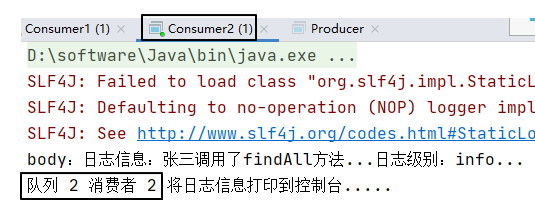

## 四、小结

交换机和队列的绑定关系如下图所示：

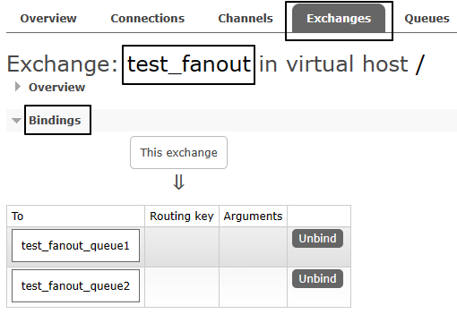

交换机需要与队列进行绑定，绑定之后；一个消息可以被多个消费者都收到。

**发布订阅模式与工作队列模式的区别：**

- 工作队列模式本质上是绑定默认交换机
- 发布订阅模式绑定指定交换机
- 监听同一个队列的消费端程序彼此之间是竞争关系
- 绑定同一个交换机的多个队列在发布订阅模式下，消息是广播的，每个队列都能接收到消息


---

# 操作006-路由模式

> 上一篇：[[Operation004-PubSub]] · 下一篇：[[Operation006-Topics]]

## 一、生产者代码

```java
package com.atguigu.rabbitmq.routing;  
  
import com.atguigu.rabbitmq.util.ConnectionUtil;  
import com.rabbitmq.client.BuiltinExchangeType;  
import com.rabbitmq.client.Channel;  
import com.rabbitmq.client.Connection;  
import com.rabbitmq.client.ConnectionFactory;  
  
public class Producer {  
  
    public static void main(String[] args) throws Exception {  
  
      Connection connection = ConnectionUtil.getConnection();  
  
      Channel channel = connection.createChannel();  
  
      String exchangeName = "test_direct";  
  
      // 创建交换机  
      channel.exchangeDeclare(exchangeName,BuiltinExchangeType.DIRECT,true,false,false,null);  
  
      // 创建队列  
      String queue1Name = "test_direct_queue1";  
      String queue2Name = "test_direct_queue2";  
  
      // 声明（创建）队列  
      channel.queueDeclare(queue1Name,true,false,false,null);  
      channel.queueDeclare(queue2Name,true,false,false,null);  
  
      // 队列绑定交换机  
      // 队列1绑定error  
      channel.queueBind(queue1Name,exchangeName,"error");  
  
      // 队列2绑定info error warning  
      channel.queueBind(queue2Name,exchangeName,"info");  
      channel.queueBind(queue2Name,exchangeName,"error");  
      channel.queueBind(queue2Name,exchangeName,"warning");  
  
        String message = "日志信息：张三调用了delete方法.错误了,日志级别warning";  
  
        // 发送消息  
        channel.basicPublish(exchangeName,"warning",null,message.getBytes());  
        System.out.println(message);  
  
      // 释放资源  
        channel.close();  
        connection.close();  
  
    }  
  
}
```

## 二、消费者代码

### 1、消费者1号

```java
package com.atguigu.rabbitmq.routing;  
  
import com.atguigu.rabbitmq.util.ConnectionUtil;  
import com.rabbitmq.client.*;  
import java.io.IOException;  
  
public class Consumer1 {  
  
    public static void main(String[] args) throws Exception {  
  
        Connection connection = ConnectionUtil.getConnection();  
  
        Channel channel = connection.createChannel();  
  
        String queue1Name = "test_direct_queue1";  
  
        channel.queueDeclare(queue1Name,true,false,false,null);  
  
        Consumer consumer = new DefaultConsumer(channel){  
  
            @Override  
            public void handleDelivery(String consumerTag, Envelope envelope, AMQP.BasicProperties properties, byte[] body) throws IOException {  
  
                System.out.println("body："+new String(body));  
                System.out.println("Consumer1 将日志信息打印到控制台.....");  
  
            }  
  
        };  
  
        channel.basicConsume(queue1Name,true,consumer);  
  
    }  
  
}
```

### 2、消费者2号

```java
package com.atguigu.rabbitmq.routing;  
  
import com.atguigu.rabbitmq.util.ConnectionUtil;  
import com.rabbitmq.client.*;  
import java.io.IOException;  
  
public class Consumer2 {  
  
    public static void main(String[] args) throws Exception {  
  
        Connection connection = ConnectionUtil.getConnection();  
  
        Channel channel = connection.createChannel();  
  
        String queue2Name = "test_direct_queue2";  
  
        channel.queueDeclare(queue2Name,true,false,false,null);  
  
        Consumer consumer = new DefaultConsumer(channel){  
  
            @Override  
            public void handleDelivery(String consumerTag, Envelope envelope, AMQP.BasicProperties properties, byte[] body) throws IOException {  
  
                System.out.println("body："+new String(body));  
                System.out.println("Consumer2 将日志信息存储到数据库.....");  
  
            }  
  
        };  
  
        channel.basicConsume(queue2Name,true,consumer);  
  
    }  
  
}
```

## 三、运行结果

### 1、绑定关系

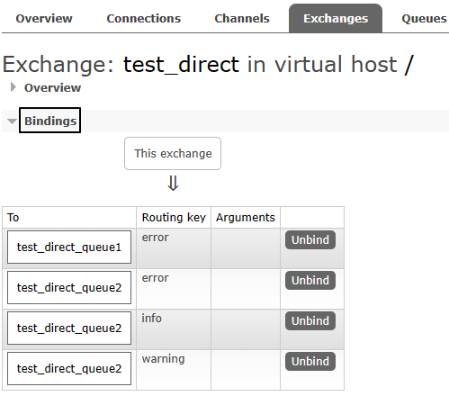

### 2、消费消息

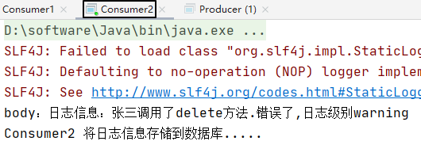


---

# 操作006：主题模式

> 上一篇：[[Operation005-Routing]] · 下一篇：[[Operation007-SpringBoot]]

## 一、生产者代码

```java
package com.atguigu.rabbitmq.topic;  
  
import com.atguigu.rabbitmq.util.ConnectionUtil;  
import com.rabbitmq.client.BuiltinExchangeType;  
import com.rabbitmq.client.Channel;  
import com.rabbitmq.client.Connection;  
import com.rabbitmq.client.ConnectionFactory;  
  
public class Producer {  
  
    public static void main(String[] args) throws Exception {  
  
        Connection connection = ConnectionUtil.getConnection();  
  
        Channel channel = connection.createChannel();  
  
        String exchangeName = "test_topic";  
  
        channel.exchangeDeclare(exchangeName, BuiltinExchangeType.TOPIC,true,false,false,null);  
  
        String queue1Name = "test_topic_queue1";  
        String queue2Name = "test_topic_queue2";  
  
        channel.queueDeclare(queue1Name,true,false,false,null);  
        channel.queueDeclare(queue2Name,true,false,false,null);  
  
        // 绑定队列和交换机  
      // 参数1. queue：队列名称  
      // 参数2. exchange：交换机名称  
      // 参数3. routingKey：路由键,绑定规则  
      //      如果交换机的类型为fanout ,routingKey设置为""  
        // routing key 常用格式：系统的名称.日志的级别。  
        // 需求： 所有error级别的日志存入数据库,所有order系统的日志存入数据库  
        channel.queueBind(queue1Name,exchangeName,"#.error");  
        channel.queueBind(queue1Name,exchangeName,"order.*");  
        channel.queueBind(queue2Name,exchangeName,"*.*");  
  
        // 分别发送消息到队列：order.info、goods.info、goods.error  
        String body = "[所在系统：order][日志级别：info][日志内容：订单生成，保存成功]";  
        channel.basicPublish(exchangeName,"order.info",null,body.getBytes());  
  
        body = "[所在系统：goods][日志级别：info][日志内容：商品发布成功]";  
        channel.basicPublish(exchangeName,"goods.info",null,body.getBytes());  
  
        body = "[所在系统：goods][日志级别：error][日志内容：商品发布失败]";  
        channel.basicPublish(exchangeName,"goods.error",null,body.getBytes());  
  
        channel.close();  
        connection.close();  
  
    }  
  
}
```

## 二、消费者代码

### 1、消费者1号

消费者1监听队列1：

```java
package com.atguigu.rabbitmq.topic;  
  
import com.atguigu.rabbitmq.util.ConnectionUtil;  
import com.rabbitmq.client.*;  
import java.io.IOException;  
  
public class Consumer1 {  
  
    public static void main(String[] args) throws Exception {  
  
        Connection connection = ConnectionUtil.getConnection();  
  
        Channel channel = connection.createChannel();  
  
        String QUEUE_NAME = "test_topic_queue1";  
  
        channel.queueDeclare(QUEUE_NAME,true,false,false,null);  
  
        Consumer consumer = new DefaultConsumer(channel){  
  
            @Override  
            public void handleDelivery(String consumerTag, Envelope envelope, AMQP.BasicProperties properties, byte[] body) throws IOException {  
  
                System.out.println("body："+new String(body));  
  
            }  
  
        };  
  
        channel.basicConsume(QUEUE_NAME,true,consumer);  
  
    }  
  
}
```

### 2、消费者2号

消费者2监听队列2：

```java
package com.atguigu.rabbitmq.topic;  
  
import com.atguigu.rabbitmq.util.ConnectionUtil;  
import com.rabbitmq.client.*;  
import java.io.IOException;  
  
public class Consumer2 {  
  
    public static void main(String[] args) throws Exception {  
  
        Connection connection = ConnectionUtil.getConnection();  
  
        Channel channel = connection.createChannel();  
  
        String QUEUE_NAME = "test_topic_queue2";  
  
        channel.queueDeclare(QUEUE_NAME,true,false,false,null);  
  
        Consumer consumer = new DefaultConsumer(channel){  
  
            @Override  
            public void handleDelivery(String consumerTag, Envelope envelope, AMQP.BasicProperties properties, byte[] body) throws IOException {  
  
                System.out.println("body："+new String(body));  
  
            }  
  
        };  
  
        channel.basicConsume(QUEUE_NAME,true,consumer);  
  
    }  
  
}
```

## 三、运行效果

队列1：

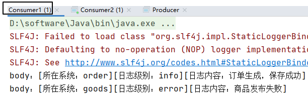

队列2：

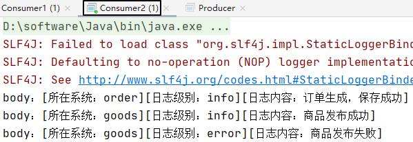


---

# 操作007：整合SpringBoot

> 上一篇：[[Operation006-Topics]] · 下一篇：[[Operation008-Confirm01-A-Producer]]

### 1、消费者工程

#### ①创建module

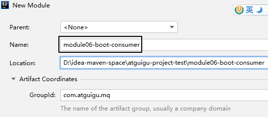

#### ②配置POM

```xml
<parent>
    <groupId>org.springframework.boot</groupId>
    <artifactId>spring-boot-starter-parent</artifactId>
    <version>3.1.5</version>
</parent>

<dependencies>
    <dependency>
        <groupId>org.springframework.boot</groupId>
        <artifactId>spring-boot-starter-amqp</artifactId>
    </dependency>
    <dependency>
        <groupId>org.springframework.boot</groupId>
        <artifactId>spring-boot-starter-web</artifactId>
    </dependency>
    <dependency>
        <groupId>org.projectlombok</groupId>
        <artifactId>lombok</artifactId>
    </dependency>
</dependencies>
```

#### ③YAML

增加日志打印的配置：

```yaml
spring:
  rabbitmq:
    host: 192.168.200.100
    port: 5672
    username: guest
    password: 123456
    virtual-host: /
logging:
  level:
    com.atguigu.mq.listener.MyMessageListener: info
```

#### ④主启动类

仿照生产者工程的主启动类，改一下类名即可

```java
package com.atguigu.mq;

import org.springframework.boot.SpringApplication;
import org.springframework.boot.autoconfigure.SpringBootApplication;

@SpringBootApplication
public class RabbitMQConsumerMainType {

    public static void main(String[] args) {
        SpringApplication.run(RabbitMQConsumerMainType.class, args);
    }

}
```

#### ⑤监听器

```java
package com.atguigu.mq.listener;

import lombok.extern.slf4j.Slf4j;
import com.rabbitmq.client.Channel;
import org.springframework.amqp.core.Message;
import org.springframework.amqp.rabbit.annotation.Exchange;
import org.springframework.amqp.rabbit.annotation.Queue;
import org.springframework.amqp.rabbit.annotation.QueueBinding;
import org.springframework.amqp.rabbit.annotation.RabbitListener;
import org.springframework.stereotype.Component;

@Component
@Slf4j
public class MyMessageListener {
  
    public static final String EXCHANGE_DIRECT = "exchange.direct.order";  
    public static final String ROUTING_KEY = "order";  
    public static final String QUEUE_NAME  = "queue.order";  
  
    @RabbitListener(bindings = @QueueBinding(
            value = @Queue(value = QUEUE_NAME, durable = "true"),
            exchange = @Exchange(value = EXCHANGE_DIRECT),
            key = {ROUTING_KEY}
    ))
    public void processMessage(String dateString,
                               Message message,
                               Channel channel) {
        log.info(dateString);
    }
  
}
```

### 2、@RabbitListener注解属性对比

#### ①bindings属性

- 表面作用：
  - 指定交换机和队列之间的绑定关系
  - 指定当前方法要监听的队列
- 隐藏效果：如果RabbitMQ服务器上没有这里指定的交换机和队列，那么框架底层的代码会创建它们

#### ②queues属性

```java
@RabbitListener(queues = {QUEUE_ATGUIGU})
```

- 作用：指定当前方法要监听的队列
- <span style="color:blue;font-weight:bolder;">注意</span>：此时框架不会创建相关交换机和队列，必须提前创建好

### 3、生产者工程

#### ①创建module

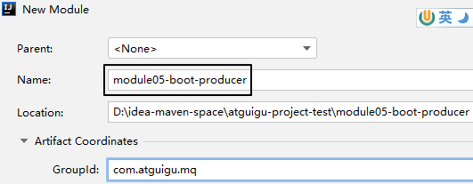

#### ②配置POM

```xml
<parent>
    <groupId>org.springframework.boot</groupId>
    <artifactId>spring-boot-starter-parent</artifactId>
    <version>3.1.5</version>
</parent>

<dependencies>
    <dependency>
        <groupId>org.springframework.boot</groupId>
        <artifactId>spring-boot-starter-amqp</artifactId>
    </dependency>
    <dependency>
        <groupId>org.springframework.boot</groupId>
        <artifactId>spring-boot-starter-test</artifactId>
    </dependency>
</dependencies>
```

#### ③YAML

```yaml
spring: 
  rabbitmq: 
    host: 192.168.200.100
    port: 5672 
    username: guest 
    password: 123456 
    virtual-host: /
```

#### ④主启动类

```java
package com.atguigu.mq;  
  
import org.springframework.boot.SpringApplication;  
import org.springframework.boot.autoconfigure.SpringBootApplication;  
  
@SpringBootApplication
public class RabbitMQProducerMainType {

    public static void main(String[] args) {
        SpringApplication.run(RabbitMQProducerMainType.class, args);  
    }

}
```

#### ⑤测试程序

```java
package com.atguigu.mq.test;
  
import org.junit.jupiter.api.Test;
import org.springframework.amqp.rabbit.core.RabbitTemplate;
import org.springframework.beans.factory.annotation.Autowired;
import org.springframework.boot.test.context.SpringBootTest;

@SpringBootTest  
public class RabbitMQTest {  
  
    public static final String EXCHANGE_DIRECT = "exchange.direct.order";  
    public static final String ROUTING_KEY = "order";
  
    @Autowired  
    private RabbitTemplate rabbitTemplate;
  
    @Test  
    public void testSendMessage() {  
        rabbitTemplate.convertAndSend(  
                EXCHANGE_DIRECT,   
                ROUTING_KEY,   
                "Hello atguigu");  
    }  
  
}
```


---

# 操作008-01-A：生产者端消息确认机制

> 上一篇：[[Operation007-SpringBoot]] · 下一篇：[[Operation008-Confirm01-B-BackupEx]]

## 一、创建module

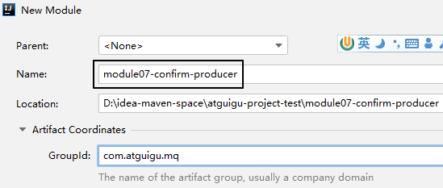

## 二、搭建环境

### 1、配置POM

```xml
<parent>
    <groupId>org.springframework.boot</groupId>
    <artifactId>spring-boot-starter-parent</artifactId>
    <version>3.1.5</version>
</parent>

<dependencies>
    <dependency>
        <groupId>org.springframework.boot</groupId>
        <artifactId>spring-boot-starter-amqp</artifactId>
    </dependency>
    <dependency>
        <groupId>org.springframework.boot</groupId>
        <artifactId>spring-boot-starter-test</artifactId>
    </dependency>
    <dependency>
        <groupId>org.projectlombok</groupId>
        <artifactId>lombok</artifactId>
    </dependency>
</dependencies>
```

### 2、主启动类

没有特殊设定：

```java
package com.atguigu.mq;  
  
import org.springframework.boot.SpringApplication;  
import org.springframework.boot.autoconfigure.SpringBootApplication;  
  
@SpringBootApplication
public class RabbitMQProducerMainType {

    public static void main(String[] args) {
        SpringApplication.run(RabbitMQProducerMainType.class, args);  
    }

}
```

### 3、YAML

<span style="color:blue;font-weight:bold;">注意</span>：publisher-confirm-type和publisher-returns是两个必须要增加的配置，如果没有则本节功能不生效

```yaml
spring:
  rabbitmq:
    host: 192.168.200.100
    port: 5672
    username: guest
    password: 123456
    virtual-host: /
    publisher-confirm-type: CORRELATED # 交换机的确认
    publisher-returns: true # 队列的确认
logging:
  level:
    com.atguigu.mq.config.MQProducerAckConfig: info
```

## 三、创建配置类

### 1、目标

在这里我们为什么要创建这个配置类呢？首先，我们需要声明回调函数来接收RabbitMQ服务器返回的确认信息：

| 方法名            | 方法功能                 | 所属接口        | 接口所属类     |
| ----------------- | ------------------------ | --------------- | -------------- |
| confirm()         | 确认消息是否发送到交换机 | ConfirmCallback | RabbitTemplate |
| returnedMessage() | 确认消息是否发送到队列   | ReturnsCallback | RabbitTemplate |

然后，就是对RabbitTemplate的功能进行增强，因为回调函数所在对象必须设置到RabbitTemplate对象中才能生效。

原本RabbitTemplate对象并没有生产者端消息确认的功能，要给它设置对应的组件才可以。

而设置对应的组件，需要调用RabbitTemplate对象下面两个方法：

| 设置组件调用的方法   | 所需对象类型            |
| -------------------- | ----------------------- |
| setConfirmCallback() | ConfirmCallback接口类型 |
| setReturnCallback()  | ReturnCallback接口类型  |

### 2、API说明

#### ①ConfirmCallback接口

这是RabbitTemplate内部的一个接口，源代码如下：

```java
	/**
	 * A callback for publisher confirmations.
	 *
	 */
	@FunctionalInterface
	public interface ConfirmCallback {

		/**
		 * Confirmation callback.
		 * @param correlationData correlation data for the callback.
		 * @param ack true for ack, false for nack
		 * @param cause An optional cause, for nack, when available, otherwise null.
		 */
		void confirm(@Nullable CorrelationData correlationData, boolean ack, @Nullable String cause);

	}
```

生产者端发送消息之后，回调confirm()方法

- ack参数值为true：表示消息成功发送到了交换机
- ack参数值为false：表示消息没有发送到交换机

#### ②ReturnCallback接口

同样也RabbitTemplate内部的一个接口，源代码如下：

```java
	/**
	 * A callback for returned messages.
	 *
	 * @since 2.3
	 */
	@FunctionalInterface
	public interface ReturnsCallback {

		/**
		 * Returned message callback.
		 * @param returned the returned message and metadata.
		 */
		void returnedMessage(ReturnedMessage returned);

	}
```

<span style="color:blue;font-weight:bold;">注意</span>：接口中的returnedMessage()方法<span style="color:blue;font-weight:bold;font-size:25px;">仅</span>在消息<span style="color:blue;font-weight:bold;font-size:25px;">没有</span>发送到队列时调用

ReturnedMessage类中主要属性含义如下：

| 属性名     | 类型                                  | 含义                         |
| ---------- | ------------------------------------- | ---------------------------- |
| message    | org.springframework.amqp.core.Message | 消息以及消息相关数据         |
| replyCode  | int                                   | 应答码，类似于HTTP响应状态码 |
| replyText  | String                                | 应答码说明                   |
| exchange   | String                                | 交换机名称                   |
| routingKey | String                                | 路由键名称                   |

### 3、配置类代码

#### ①要点1

加@Component注解，加入IOC容器

#### ②要点2

配置类自身实现ConfirmCallback、ReturnCallback这两个接口，然后通过this指针把配置类的对象设置到RabbitTemplate对象中。

操作封装到了一个专门的void init()方法中。

为了保证这个void init()方法在应用启动时被调用，我们使用@PostConstruct注解来修饰这个方法。

关于@PostConstruct注解大家可以参照以下说明：

> @PostConstruct注解是<span style="color:blue;font-weight:bolder;">Java中的一个标准注解</span>，它用于指定在<span style="color:blue;font-weight:bolder;">对象创建之后立即执行</span>的方法。当使用依赖注入（如Spring框架）或者其他方式创建对象时，@PostConstruct注解可以确保在对象完全初始化之后，执行相应的方法。
>
> 使用@PostConstruct注解的方法必须满足以下条件：
>
> 1. <span style="color:blue;font-weight:bolder;">方法不能有任何参数</span>。
> 2. <span style="color:blue;font-weight:bolder;">方法必须是非静态的</span>。
> 3. <span style="color:blue;font-weight:bolder;">方法不能返回任何值</span>。
>
> 当容器实例化一个带有@PostConstruct注解的Bean时，它会在<span style="color:blue;font-weight:bolder;">调用构造函数之后</span>，并在<span style="color:blue;font-weight:bolder;">依赖注入完成之前</span>调用被@PostConstruct注解标记的方法。这样，我们可以在该方法中进行一些初始化操作，比如读取配置文件、建立数据库连接等。

#### ③代码

有了以上说明，下面我们就可以展示配置类的整体代码：

```java
package com.atguigu.mq.config;

import jakarta.annotation.PostConstruct;
import lombok.extern.slf4j.Slf4j;
import org.springframework.amqp.core.ReturnedMessage;
import org.springframework.amqp.rabbit.connection.CorrelationData;
import org.springframework.amqp.rabbit.core.RabbitTemplate;
import org.springframework.beans.factory.annotation.Autowired;
import org.springframework.stereotype.Component;

@Component
@Slf4j
public class MQProducerAckConfig implements RabbitTemplate.ConfirmCallback, RabbitTemplate.ReturnsCallback{

    @Autowired
    private RabbitTemplate rabbitTemplate;

    @PostConstruct
    public void init() {
        rabbitTemplate.setConfirmCallback(this);
        rabbitTemplate.setReturnsCallback(this);
    }

    @Override
    public void confirm(CorrelationData correlationData, boolean ack, String cause) {
        if (ack) {
            log.info("消息发送到交换机成功！数据：" + correlationData);
        } else {
            log.info("消息发送到交换机失败！数据：" + correlationData + " 原因：" + cause);
        }
    }

    @Override
    public void returnedMessage(ReturnedMessage returned) {
        log.info("消息主体: " + new String(returned.getMessage().getBody()));
        log.info("应答码: " + returned.getReplyCode());
        log.info("描述：" + returned.getReplyText());
        log.info("消息使用的交换器 exchange : " + returned.getExchange());
        log.info("消息使用的路由键 routing : " + returned.getRoutingKey());
    }
}
```

## 四、发送消息

```java
package com.atguigu.mq.test;
  
import org.junit.jupiter.api.Test;
import org.springframework.amqp.rabbit.core.RabbitTemplate;
import org.springframework.beans.factory.annotation.Autowired;
import org.springframework.boot.test.context.SpringBootTest;

@SpringBootTest  
public class RabbitMQTest {  
  
    public static final String EXCHANGE_DIRECT = "exchange.direct.order";
    public static final String ROUTING_KEY = "order";
  
    @Autowired  
    private RabbitTemplate rabbitTemplate;
  
    @Test  
    public void testSendMessage() {  
        rabbitTemplate.convertAndSend(  
                EXCHANGE_DIRECT,   
                ROUTING_KEY,   
                "Hello atguigu");  
    }  
  
}
```

通过调整代码，测试如下三种情况：

- 交换机正确、路由键正确
- 交换机正确、路由键不正确，无法发送到队列
- 交换机不正确，无法发送到交换机


---

# 操作008-01-B：备份交换机

> 上一篇：[[Operation008-Confirm01-A-Producer]] · 下一篇：[[Operation008-Confirm02-Duration]]

## 一、创建备份交换机

### 1、创建备份交换机

<span style="color:blue;font-weight:bolder;">注意</span>：备份交换机<span style="color:blue;font-weight:bolder;">一定</span>要选择<span style="color:blue;font-weight:bolder;">fanout类型</span>，因为原交换机转入备份交换机时并不会指定路由键

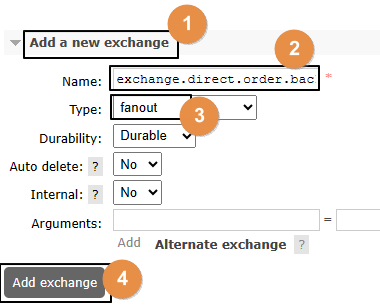

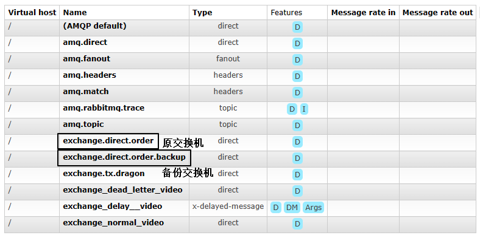

### 2、创建备份交换机要绑定的队列

#### ①创建队列

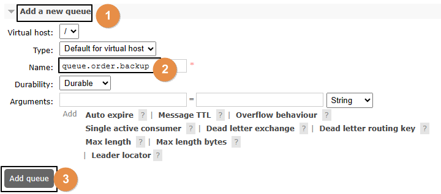

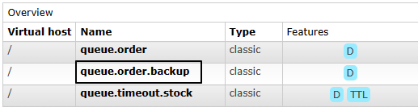

#### ②绑定交换机

<span style="color:blue;font-weight:bolder;">注意</span>：这里是要和备份交换机绑定

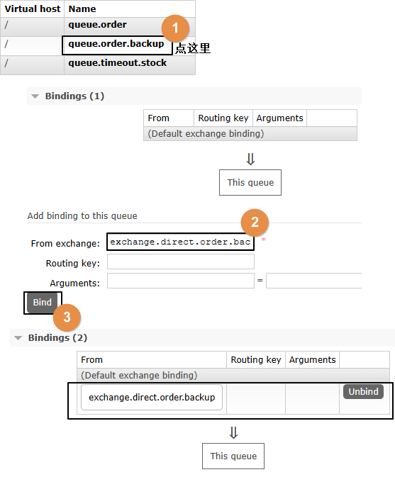

### 3、针对备份队列创建消费端监听器

```java
    public static final String EXCHANGE_DIRECT_BACKUP = "exchange.direct.order.backup";
    public static final String QUEUE_NAME_BACKUP  = "queue.order.backup";

    @RabbitListener(bindings = @QueueBinding(
            value = @Queue(value = QUEUE_NAME_BACKUP, durable = "true"),
            exchange = @Exchange(value = EXCHANGE_DIRECT_BACKUP),
            key = {""}
    ))
    public void processMessageBackup(String dateString,
                                     Message message,
                                     Channel channel) {
        log.info("BackUp: " + dateString);
    }
```

## 二、设定备份关系

### 1、原交换机删除

·

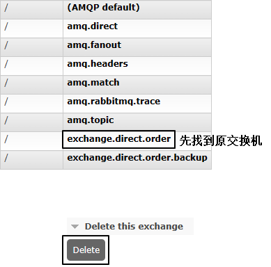

### 2、重新创建原交换机

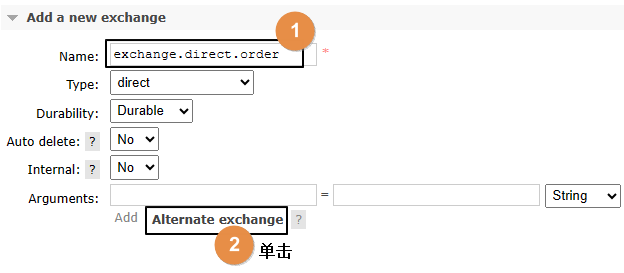

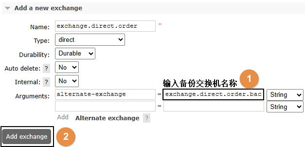

### 3、原交换机重新绑定原队列

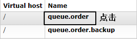

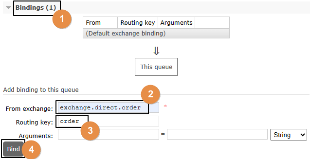

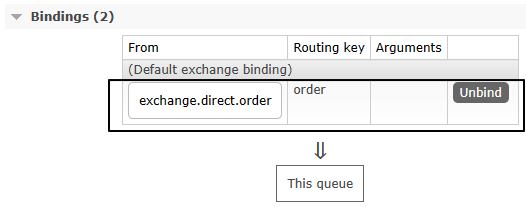

## 三、测试

- 启动消费者端
- 发送消息，但是路由键不对，于是转入备份交换机


---

# 操作008-02：交换机和队列持久化

> 上一篇：[[Operation008-Confirm01-B-BackupEx]] · 下一篇：[[Operation008-Confirm03-Consumer]]

## 一、测试非持久化交换机和队列

### 1、创建非持久化交换机

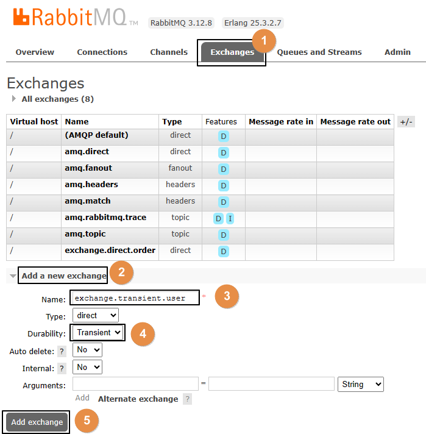

创建之后，可以在列表中看到：

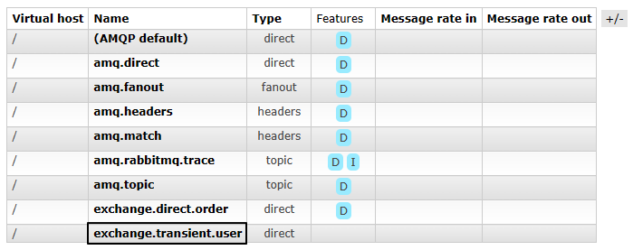

### 2、创建非持久化队列

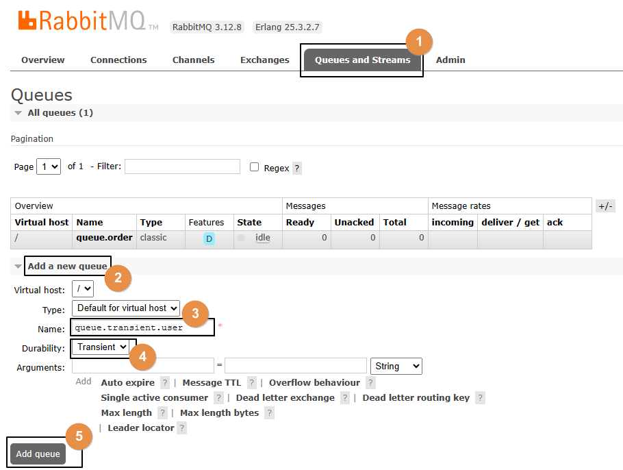

创建之后，可以在列表中看到：

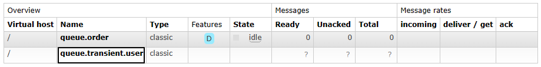

### 3、绑定

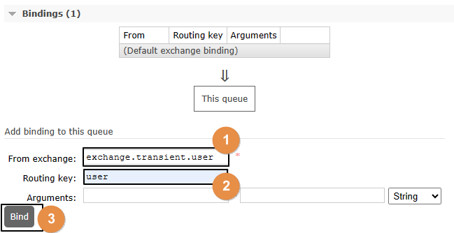

### 4、发送消息

```java
    public static final String EXCHANGE_TRANSIENT = "exchange.transient.user";
    public static final String ROUTING_KEY_TRANSIENT = "user";

    @Test
    public void testSendMessageTransient() {
        rabbitTemplate.convertAndSend(
                EXCHANGE_TRANSIENT,
                ROUTING_KEY_TRANSIENT,
                "Hello atguigu user~~~");
    }
```

### 5、查看已发送消息

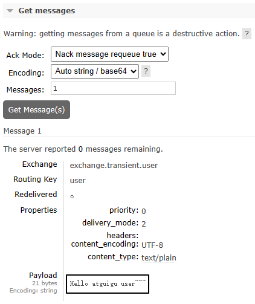

结论：临时性的交换机和队列也能够接收消息，但如果RabbitMQ服务器重启之后会怎么样呢？

### 6、重启RabbitMQ服务器

```shell
docker restart rabbitmq
```

重启之后，刚才临时性的交换机和队列都没了。在交换机和队列这二者中，队列是消息存储的容器，队列没了，消息就也跟着没了。

## 二、持久化的交换机和队列

我们其实不必专门创建持久化的交换机和队列，因为它们默认就是持久化的。接下来我们只需要确认一下：存放到队列中，尚未被消费端取走的消息，是否会随着RabbitMQ服务器重启而丢失？

### 1、发送消息

运行以前的发送消息方法即可，不过要关掉消费端程序

### 2、在管理界面查看消息

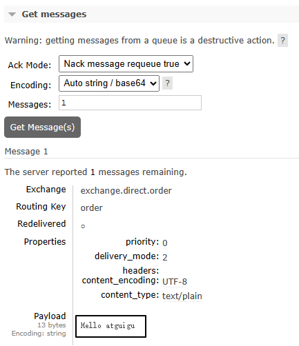

### 3、重启RabbitMQ服务器

```shell
docker restart rabbitmq
```

### 4、再次查看消息

仍然还在：

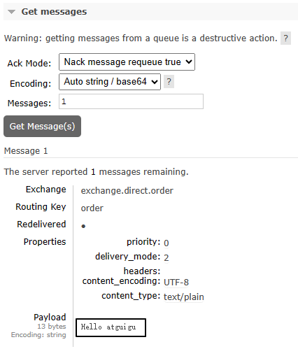

## 三、结论

在后台管理界面创建交换机和队列时，默认就是持久化的模式。

此时消息也是持久化的，不需要额外设置。


---

# 操作008-03：消费端消息确认

> 上一篇：[[Operation008-Confirm02-Duration]] · 下一篇：[[Operation009-Prefetch]]

## 一、ACK

ACK是acknowledge的缩写，表示已确认

## 二、默认情况

默认情况下，消费端取回消息后，默认会自动返回ACK确认消息，所以在前面的测试中消息被消费端消费之后，RabbitMQ得到ACK确认信息就会删除消息

但实际开发中，消费端根据消息队列投递的消息执行对应的业务，未必都能执行成功，如果希望能够多次重试，那么默认设定就不满足要求了

所以还是要修改成手动确认

## 三、创建消费端module

### 1、配置POM

```xml
<parent>
    <groupId>org.springframework.boot</groupId>
    <artifactId>spring-boot-starter-parent</artifactId>
    <version>3.1.5</version>
</parent>

<dependencies>
    <dependency>
        <groupId>org.springframework.boot</groupId>
        <artifactId>spring-boot-starter-amqp</artifactId>
    </dependency>
    <dependency>
        <groupId>org.springframework.boot</groupId>
        <artifactId>spring-boot-starter-web</artifactId>
    </dependency>
    <dependency>
        <groupId>org.projectlombok</groupId>
        <artifactId>lombok</artifactId>
    </dependency>
</dependencies>
```

### 2、YAML

增加针对监听器的设置：

```yaml
spring:
  rabbitmq:
    host: 192.168.200.100
    port: 5672
    username: guest
    password: 123456
    virtual-host: /
    listener:
      simple:
        acknowledge-mode: manual # 把消息确认模式改为手动确认
```

### 3、主启动类

没有特殊设定：

```java
package com.atguigu.mq;

import org.springframework.boot.SpringApplication;
import org.springframework.boot.autoconfigure.SpringBootApplication;

@SpringBootApplication
public class RabbitMQConsumerMainType {

    public static void main(String[] args) {
        SpringApplication.run(RabbitMQConsumerMainType.class, args);
    }

}
```

## 四、消费端监听器

### 1、创建监听器类

```java
package com.atguigu.mq.listener;

import com.rabbitmq.client.Channel;
import org.springframework.amqp.core.Message;
import org.springframework.stereotype.Component;

@Component
public class MyMessageListener {

    public static final String EXCHANGE_DIRECT = "exchange.direct.order";
    public static final String ROUTING_KEY = "order";
    public static final String QUEUE_NAME  = "queue.order";

    public void processMessage(String dataString, Message message, Channel channel) {

    }

}
```

### 2、在接收消息的方法上应用注解

```java
// 修饰监听方法
@RabbitListener(
        // 设置绑定关系
        bindings = @QueueBinding(

            // 配置队列信息：durable 设置为 true 表示队列持久化；autoDelete 设置为 false 表示关闭自动删除
            value = @Queue(value = QUEUE_NAME, durable = "true", autoDelete = "false"),

            // 配置交换机信息：durable 设置为 true 表示队列持久化；autoDelete 设置为 false 表示关闭自动删除
            exchange = @Exchange(value = EXCHANGE_DIRECT, durable = "true", autoDelete = "false"),

            // 配置路由键信息
            key = {ROUTING_KEY}
))
public void processMessage(String dataString, Message message, Channel channel) {

}
```

### 3、接收消息方法内部逻辑

- 业务处理成功：手动返回ACK信息，表示消息成功消费
- 业务处理失败：手动返回NACK信息，表示消息消费失败。此时有两种后续操作供选择：
  - 把消息重新放回消息队列，RabbitMQ会重新投递这条消息，那么消费端将重新消费这条消息——从而让业务代码再执行一遍
  - 不把消息放回消息队列，返回reject信息表示拒绝，那么这条消息的处理就到此为止

### 4、相关API

先回到PPT理解“deliveryTag：交付标签机制”

下面我们探讨的三个方法都是来自于com.rabbitmq.client.<span style="color:blue;font-weight:bolder;">Channel</span>接口

#### ①basicAck()方法

- 方法功能：给Broker返回ACK确认信息，表示消息已经在消费端成功消费，这样Broker就可以把消息删除了
- 参数列表：

| 参数名称         | 含义                                                         |
| ---------------- | ------------------------------------------------------------ |
| long deliveryTag | Broker给每一条进入队列的消息都设定一个唯一标识               |
| boolean multiple | 取值为true：为小于、等于deliveryTag的消息批量返回ACK信息<br/>取值为false：仅为指定的deliveryTag返回ACK信息 |

#### ②basicNack()方法

- 方法功能：给Broker返回NACK信息，表示消息在消费端消费失败，此时Broker的后续操作取决于参数requeue的值
- 参数列表：

| 参数名称         | 含义                                                         |
| ---------------- | ------------------------------------------------------------ |
| long deliveryTag | Broker给每一条进入队列的消息都设定一个唯一标识               |
| boolean multiple | 取值为true：为小于、等于deliveryTag的消息批量返回ACK信息<br/>取值为false：仅为指定的deliveryTag返回ACK信息 |
| boolean requeue  | 取值为true：Broker将消息重新放回队列，接下来会重新投递给消费端<br/>取值为false：Broker将消息标记为已消费，不会放回队列 |

#### ③basicReject()方法

- 方法功能：根据指定的deliveryTag，对该消息表示拒绝
- 参数列表：

| 参数名称         | 含义                                                         |
| ---------------- | ------------------------------------------------------------ |
| long deliveryTag | Broker给每一条进入队列的消息都设定一个唯一标识               |
| boolean requeue  | 取值为true：Broker将消息重新放回队列，接下来会重新投递给消费端<br/>取值为false：Broker将消息标记为已消费，不会放回队列 |

- basicNack()和basicReject()有啥区别？
  - basicNack()有批量操作
  - basicReject()没有批量操作

### 5、完整代码示例

```java
package com.atguigu.mq.listener;

import com.rabbitmq.client.Channel;
import lombok.extern.slf4j.Slf4j;
import org.springframework.amqp.core.Message;
import org.springframework.amqp.rabbit.annotation.Exchange;
import org.springframework.amqp.rabbit.annotation.Queue;
import org.springframework.amqp.rabbit.annotation.QueueBinding;
import org.springframework.amqp.rabbit.annotation.RabbitListener;
import org.springframework.stereotype.Component;

import java.io.IOException;

@Component
@Slf4j
public class MyMessageListener {

    public static final String EXCHANGE_DIRECT = "exchange.direct.order";
    public static final String ROUTING_KEY = "order";
    public static final String QUEUE_NAME  = "queue.order";

    // 修饰监听方法
    @RabbitListener(
            // 设置绑定关系
            bindings = @QueueBinding(

                // 配置队列信息：durable 设置为 true 表示队列持久化；autoDelete 设置为 false 表示关闭自动删除
                value = @Queue(value = QUEUE_NAME, durable = "true", autoDelete = "false"),

                // 配置交换机信息：durable 设置为 true 表示队列持久化；autoDelete 设置为 false 表示关闭自动删除
                exchange = @Exchange(value = EXCHANGE_DIRECT, durable = "true", autoDelete = "false"),

                // 配置路由键信息
                key = {ROUTING_KEY}
    ))
    public void processMessage(String dataString, Message message, Channel channel) throws IOException {

        // 1、获取当前消息的 deliveryTag 值备用
        long deliveryTag = message.getMessageProperties().getDeliveryTag();

        try {
            // 2、正常业务操作
            log.info("消费端接收到消息内容：" + dataString);
            
            // System.out.println(10 / 0);

            // 3、给 RabbitMQ 服务器返回 ACK 确认信息
            channel.basicAck(deliveryTag, false);
        } catch (Exception e) {

            // 4、获取信息，看当前消息是否曾经被投递过
            Boolean redelivered = message.getMessageProperties().getRedelivered();

            if (!redelivered) {
                // 5、如果没有被投递过，那就重新放回队列，重新投递，再试一次
                channel.basicNack(deliveryTag, false, true);
            } else {
                // 6、如果已经被投递过，且这一次仍然进入了 catch 块，那么返回拒绝且不再放回队列
                channel.basicReject(deliveryTag, false);
            }

        }
    }

}
```

## 五、要点总结

- 要点1：把消息确认模式改为<span style="color:blue;font-weight:bold;">手动确认</span>
- 要点2：调用Channel对象的方法返回信息
  - ACK：Acknowledgement，表示消息处理成功
  - NACK：Negative Acknowledgement，表示消息处理失败
  - Reject：拒绝，同样表示消息处理失败
- 要点3：后续操作
  - requeue为true：重新放回队列，重新投递，再次尝试
  - requeue为false：不放回队列，不重新投递
- 要点4：deliveryTag 消息的唯一标识，查找具体某一条消息的依据

## 六、流程梳理

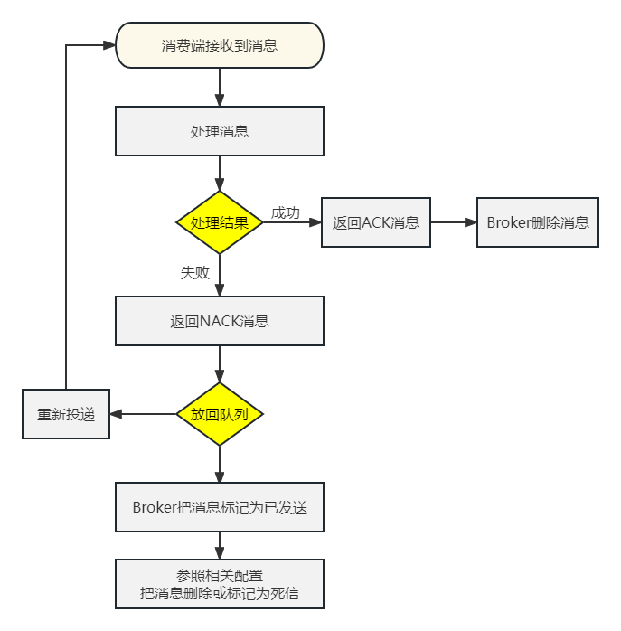

## 七、多啰嗦一句

消费端如果设定消息重新放回队列，Broker重新投递消息，那么消费端就可以再次消费消息，这是一种“重试”机制，这需要消费端代码支持“<span style="color:blue;font-weight:bold;">幂等性</span>”——这属于前置知识，不展开了。


---

# 操作009：Prefetch

> 上一篇：[[Operation008-Confirm03-Consumer]] · 下一篇：[[Operation010-MessageTimeout]]

## 一、思路

- 生产者发送100个消息
- 对照两种情况：
  - 消费端没有设置prefetch参数：100个消息被全部取回
  - 消费端设置prefetch参数为1：100个消息慢慢取回

## 二、生产者端代码

```java
@Test  
public void testSendMessage() {
    for (int i = 0; i < 100; i++) {
        rabbitTemplate.convertAndSend(
                EXCHANGE_DIRECT,
                ROUTING_KEY,
                "Hello atguigu" + i);
    }
}
```

## 三、消费者端代码

```java
// 2、正常业务操作
log.info("消费端接收到消息内容：" + dataString);

// System.out.println(10 / 0);
TimeUnit.SECONDS.sleep(1);

// 3、给 RabbitMQ 服务器返回 ACK 确认信息
channel.basicAck(deliveryTag, false);
```

## 四、测试

### 1、未使用prefetch

- 不要启动消费端程序，如果正在运行就把它停了
- 运行生产者端程序发送100条消息
- 查看队列中消息的情况：


- 说明：
  - Ready表示已经发送到队列的消息数量
  - Unacked表示已经发送到消费端但是消费端尚未返回ACK信息的消息数量
  - Total未被删除的消息总数

- 接下来启动消费端程序，再查看队列情况：


- 能看到消息全部被消费端取走了，正在逐个处理、确认，说明有多少消息消费端就并发处理多少

### 2、设定prefetch

#### ①YAML配置

```yaml
spring:
  rabbitmq:
    host: 192.168.200.100
    port: 5672
    username: guest
    password: 123456
    virtual-host: /
    listener:
      simple:
        acknowledge-mode: manual
        prefetch: 1 # 设置每次最多从消息队列服务器取回多少消息
```

#### ②测试流程

- 停止消费端程序
- 运行生产者端程序发送100条消息
- 查看队列中消息的情况：


- 接下来启动消费端程序，持续观察队列情况：


- 能看到消息不是一次性全部取回的，而是有个过程


---

# 操作010：消息超时

> 上一篇：[[Operation009-Prefetch]] · 下一篇：[[Operation011-DeadLetter]]

## 一、队列层面设置

### 1、设置

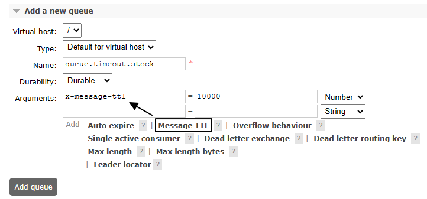

别忘了设置绑定关系：

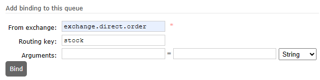

### 2、测试

- 不启动消费端程序
- 向设置了过期时间的队列中发送100条消息
- 等10秒后，看是否全部被过期删除

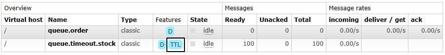

## 二、消息层面设置

### 1、设置

```java
import org.springframework.amqp.core.Message;
import org.springframework.amqp.core.MessagePostProcessor;

@Test  
public void testSendMessageTTL() {  
  
    // 1、创建消息后置处理器对象  
    MessagePostProcessor messagePostProcessor = (Message message) -> {  
  
        // 设定 TTL 时间，以毫秒为单位
        message.getMessageProperties().setExpiration("5000");  
  
        return message;
    };
  
    // 2、发送消息  
    rabbitTemplate.convertAndSend(    
            EXCHANGE_DIRECT,     
            ROUTING_KEY,     
            "Hello atguigu", messagePostProcessor);    
}
```

### 2、查看效果

这次我们是发送到普通队列上：


---

# 操作011：死信

> 上一篇：[[Operation010-MessageTimeout]] · 下一篇：[[Operation012-DelayPlugin]]

## 一、测试相关准备

### 1、创建死信交换机和死信队列

常规设定即可，没有特殊设置：

- 死信交换机：exchange.dead.letter.video
- 死信队列：queue.dead.letter.video
- 死信路由键：routing.key.dead.letter.video

### 2、创建正常交换机和正常队列

<span style="color:blue;font-weight:bolder;">注意</span>：一定要注意正常队列有诸多限定和设置，这样才能让无法处理的消息进入死信交换机

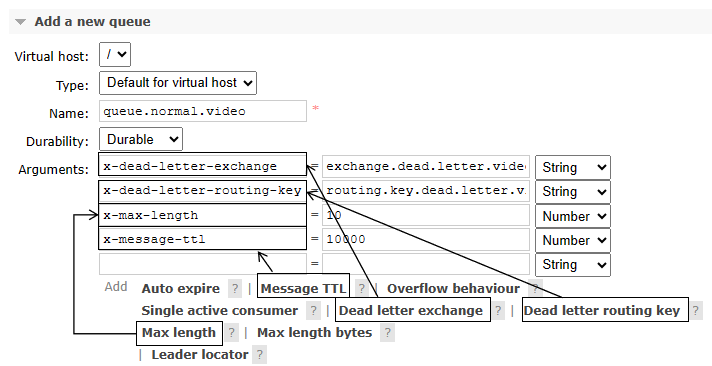

- 正常交换机：exchange.normal.video
- 正常队列：queue.normal.video
- 正常路由键：routing.key.normal.video

全部设置完成后参照如下细节：

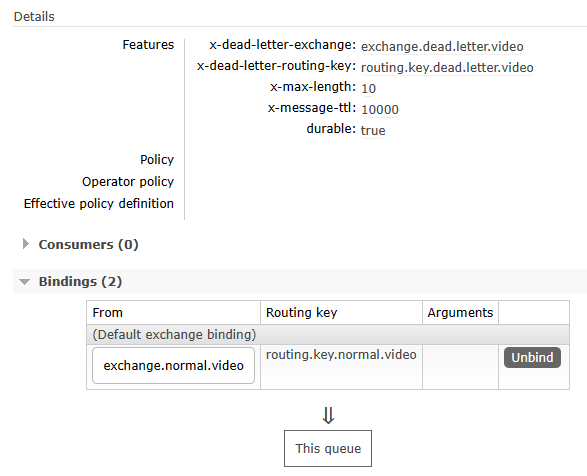

### 3、Java代码中的相关常量声明

```java
public static final String EXCHANGE_NORMAL = "exchange.normal.video";  
public static final String EXCHANGE_DEAD_LETTER = "exchange.dead.letter.video";  
  
public static final String ROUTING_KEY_NORMAL = "routing.key.normal.video";  
public static final String ROUTING_KEY_DEAD_LETTER = "routing.key.dead.letter.video";  
  
public static final String QUEUE_NORMAL = "queue.normal.video";  
public static final String QUEUE_DEAD_LETTER = "queue.dead.letter.video";
```

## 二、消费端拒收消息

### 1、发送消息的代码

```java
@Test  
public void testSendMessageButReject() {  
    rabbitTemplate  
            .convertAndSend(  
                    EXCHANGE_NORMAL,  
                    ROUTING_KEY_NORMAL,  
                    "测试死信情况1：消息被拒绝");  
}
```

### 2、接收消息的代码

#### ①监听正常队列

```java
@RabbitListener(queues = {QUEUE_NORMAL})
public void processMessageNormal(Message message, Channel channel) throws IOException {
    // 监听正常队列，但是拒绝消息
    log.info("★[normal]消息接收到，但我拒绝。");
    channel.basicReject(message.getMessageProperties().getDeliveryTag(), false);
}
```

#### ②监听死信队列

```java
@RabbitListener(queues = {QUEUE_DEAD_LETTER})
public void processMessageDead(String dataString, Message message, Channel channel) throws IOException {  
    // 监听死信队列  
    log.info("★[dead letter]dataString = " + dataString);
    log.info("★[dead letter]我是死信监听方法，我接收到了死信消息");
    channel.basicAck(message.getMessageProperties().getDeliveryTag(), false);
}
```

### 3、执行结果

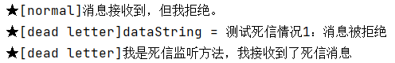

## 三、消息数量超过队列容纳极限

### 1、发送消息的代码

```java
@Test  
public void testSendMultiMessage() {  
    for (int i = 0; i < 20; i++) {  
        rabbitTemplate.convertAndSend(  
                EXCHANGE_NORMAL,  
                ROUTING_KEY_NORMAL,  
                "测试死信情况2：消息数量超过队列的最大容量" + i);  
    }  
}
```

### 2、接收消息的代码

消息接收代码不再拒绝消息：

```java
@RabbitListener(queues = {QUEUE_NORMAL})
public void processMessageNormal(Message message, Channel channel) throws IOException {
    // 监听正常队列
    log.info("★[normal]消息接收到。");
    channel.basicAck(message.getMessageProperties().getDeliveryTag(), false);
}
```

重启微服务使代码修改生效。

### 3、执行效果

正常队列的参数如下图所示：

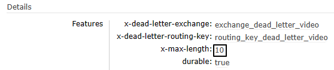

生产者发送20条消息之后，消费端死信队列接收到前10条消息：

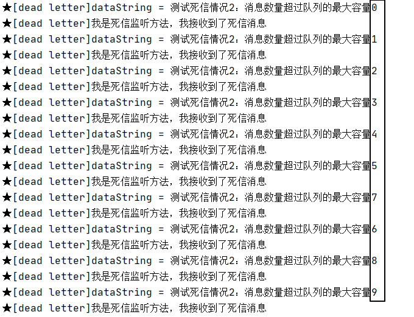

## 四、消息超时未消费

### 1、发送消息的代码

正常发送一条消息即可，所以使用第一个例子的代码。

```java
@Test
public void testSendMessageTimeout() {
    rabbitTemplate
            .convertAndSend(
                    EXCHANGE_NORMAL,
                    ROUTING_KEY_NORMAL,
                    "测试死信情况3：消息超时");
}
```

### 2、执行效果

队列参数生效：

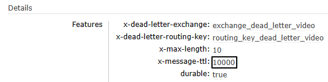

因为没有消费端监听程序，所以消息未超时前滞留在队列中：

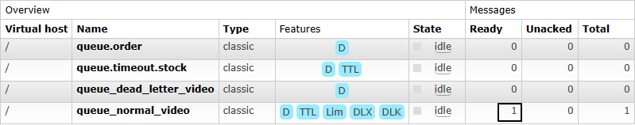

消息超时后，进入死信队列：

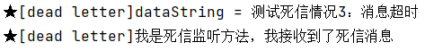


---

# 操作012：延迟插件

> 上一篇：[[Operation011-DeadLetter]] · 下一篇：[[Operation013-Tx-Producer]]

## 一、插件简介

- 官网地址：https://github.com/rabbitmq/rabbitmq-delayed-message-exchange
- 延迟极限：最多两天

## 二、插件安装

### 1、确定卷映射目录

```shell
docker inspect rabbitmq
```

运行结果：

```json
        "Mounts": [
            {
                "Type": "volume",
                "Name": "rabbitmq-plugin",
                "Source": "/var/lib/docker/volumes/rabbitmq-plugin/_data",
                "Destination": "/plugins",
                "Driver": "local",
                "Mode": "z",
                "RW": true,
                "Propagation": ""
            },
            {
                "Type": "volume",
                "Name": "cca7bc3012f5b76bd6c47a49ca6911184f9076f5f6263b41f4b9434a7f269b11",
                "Source": "/var/lib/docker/volumes/cca7bc3012f5b76bd6c47a49ca6911184f9076f5f6263b41f4b9434a7f269b11/_data",
                "Destination": "/var/lib/rabbitmq",
                "Driver": "local",
                "Mode": "",
                "RW": true,
                "Propagation": ""
            }
        ]
```

和容器内/plugins目录对应的宿主机目录是：/var/lib/docker/volumes/rabbitmq-plugin/_data

### 2、下载延迟插件

官方文档说明页地址：https://www.rabbitmq.com/community-plugins.html

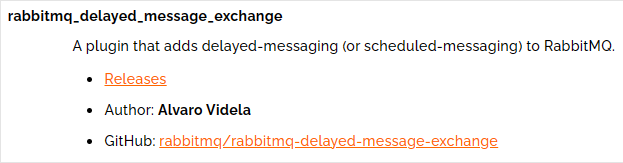

下载插件安装文件：

```shell
wget https://github.com/rabbitmq/rabbitmq-delayed-message-exchange/releases/download/v3.13.0/rabbitmq_delayed_message_exchange-3.13.0.ez
mv rabbitmq_delayed_message_exchange-3.13.0.ez /var/lib/docker/volumes/rabbitmq-plugin/_data
```

### 3、启用插件

```shell
# 登录进入容器内部
docker exec -it rabbitmq /bin/bash

# rabbitmq-plugins命令所在目录已经配置到$PATH环境变量中了，可以直接调用
rabbitmq-plugins enable rabbitmq_delayed_message_exchange

# 退出Docker容器
exit

# 重启Docker容器
docker restart rabbitmq
```

### 4、确认

确认点1：查看当前节点已启用插件的列表：

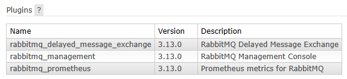

确认点2：如果创建新交换机时可以在type中看到x-delayed-message选项，那就说明插件安装好了

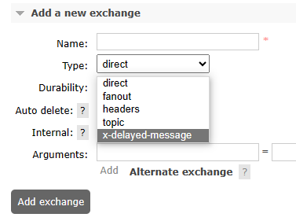

## 三、创建交换机

rabbitmq_delayed_message_exchange插件在工作时要求交换机是<span style="color:blue;font-weight:bolder;">x-delayed-message</span>类型才可以，创建方式如下：

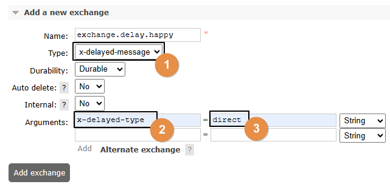

关于<span style="color:blue;font-weight:bolder;">x-delayed-type</span>参数的理解：

> 原本指定交换机类型的地方使用了x-delayed-message这个值，那么这个交换机除了支持延迟消息之外，到底是direct、fanout、topic这些类型中的哪一个呢？
>
> 这里就额外使用x-delayed-type来指定交换机本身的类型

## 四、代码测试

### 1、生产者端代码

```java
@Test
public void testSendDelayMessage() {
    rabbitTemplate.convertAndSend(
            EXCHANGE_DELAY,
            ROUTING_KEY_DELAY,
            "测试基于插件的延迟消息 [" + new SimpleDateFormat("hh:mm:ss").format(new Date()) + "]",
            messageProcessor -> {

                // 设置延迟时间：以毫秒为单位
                messageProcessor.getMessageProperties().setHeader("x-delay", "10000");

                return messageProcessor;
            });
}
```

### 2、消费者端代码

#### ①情况A：资源已创建

```java
package com.atguigu.mq.listener;

import com.rabbitmq.client.Channel;
import lombok.extern.slf4j.Slf4j;
import org.springframework.amqp.core.Message;
import org.springframework.amqp.rabbit.annotation.RabbitListener;
import org.springframework.stereotype.Component;

import java.io.IOException;
import java.text.SimpleDateFormat;
import java.util.Date;  
  
@Component  
@Slf4j
public class MyDelayMessageListener {
    
    public static final String QUEUE_DELAY = "queue.delay.video";
    
    @RabbitListener(queues = {QUEUE_DELAY})
    public void process(String dataString, Message message, Channel channel) throws IOException {  
        log.info("[生产者]" + dataString);
        log.info("[消费者]" + new SimpleDateFormat("hh:mm:ss").format(new Date()));
        channel.basicAck(message.getMessageProperties().getDeliveryTag(), false);
    }

}
```

#### ②情况B：资源未创建

```java
package com.atguigu.mq.listener;  

import com.rabbitmq.client.Channel;
import lombok.extern.slf4j.Slf4j;
import org.springframework.amqp.core.Message;  
import org.springframework.amqp.rabbit.annotation.*;  
import org.springframework.stereotype.Component;  

import java.io.IOException;  
import java.text.SimpleDateFormat;  
import java.util.Date;  
  
@Component  
@Slf4j
public class MyDelayMessageListener {  
  
    public static final String EXCHANGE_DELAY = "exchange.delay.video";
    public static final String ROUTING_KEY_DELAY = "routing.key.delay.video";
    public static final String QUEUE_DELAY = "queue.delay.video";
  
    @RabbitListener(bindings = @QueueBinding(  
        value = @Queue(value = QUEUE_DELAY, durable = "true", autoDelete = "false"),  
        exchange = @Exchange(  
                value = EXCHANGE_DELAY,   
                durable = "true",   
                autoDelete = "false",   
                type = "x-delayed-message",   
                arguments = @Argument(name = "x-delayed-type", value = "direct")),  
        key = {ROUTING_KEY_DELAY}  
    ))  
    public void process(String dataString, Message message, Channel channel) throws IOException {  
        log.info("[生产者]" + dataString);  
        log.info("[消费者]" + new SimpleDateFormat("hh:mm:ss").format(new Date()));  
        channel.basicAck(message.getMessageProperties().getDeliveryTag(), false);  
    }  

}
```

### 3、执行效果

#### ①交换机类型


#### ②生产者端效果

<span style="color:blue;font-weight:bolder;">注意</span>：使用rabbitmq_delayed_message_exchange插件后，即使消息成功发送到队列上，也会导致returnedMessage()方法执行

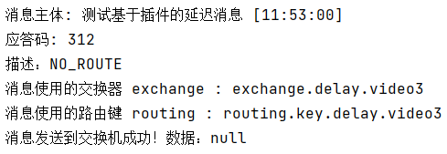

#### ③消费者端效果

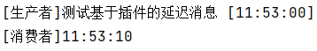


---

# 操作013：事务消息之生产者端

> 上一篇：[[Operation012-DelayPlugin]] · 下一篇：[[Operation014-LazyQueue]]

## 一、测试代码

### 1、引入依赖

```xml
<parent>
    <groupId>org.springframework.boot</groupId>
    <artifactId>spring-boot-starter-parent</artifactId>
    <version>3.1.5</version>
</parent>

<dependencies>
    <dependency>
        <groupId>org.springframework.boot</groupId>
        <artifactId>spring-boot-starter-amqp</artifactId>
    </dependency>
    <dependency>
        <groupId>org.springframework.boot</groupId>
        <artifactId>spring-boot-starter-test</artifactId>
    </dependency>
    <dependency>
        <groupId>org.projectlombok</groupId>
        <artifactId>lombok</artifactId>
    </dependency>
</dependencies>
```

### 2、yaml配置

```yaml
spring:
  rabbitmq:
    host: 192.168.200.100
    port: 5672
    username: guest
    password: 123456
    virtual-host: /
```

### 3、主启动类

```java
package com.atguigu.mq;

import org.springframework.boot.SpringApplication;
import org.springframework.boot.autoconfigure.SpringBootApplication;

@SpringBootApplication
public class RabbitMQProducerMainType {

    public static void main(String[] args) {
        SpringApplication.run(RabbitMQProducerMainType.class, args);
    }

}
```

### 4、相关配置

```java
package com.atguigu.mq.config;

import lombok.Data;
import org.springframework.amqp.rabbit.connection.CachingConnectionFactory;
import org.springframework.amqp.rabbit.core.RabbitTemplate;
import org.springframework.amqp.rabbit.transaction.RabbitTransactionManager;
import org.springframework.context.annotation.Bean;
import org.springframework.context.annotation.Configuration;

@Configuration
@Data
public class RabbitConfig {

    @Bean
    public RabbitTransactionManager transactionManager(CachingConnectionFactory connectionFactory) {
        return new RabbitTransactionManager(connectionFactory);
    }

    @Bean
    public RabbitTemplate rabbitTemplate(CachingConnectionFactory connectionFactory) {
        RabbitTemplate rabbitTemplate = new RabbitTemplate(connectionFactory);
        rabbitTemplate.setChannelTransacted(true);
        return rabbitTemplate;
    }
}
```

### 5、测试代码

```java
package com.atguigu.mq.test;

import jakarta.annotation.Resource;
import lombok.extern.slf4j.Slf4j;
import org.junit.jupiter.api.Test;
import org.springframework.amqp.rabbit.core.RabbitTemplate;
import org.springframework.boot.test.context.SpringBootTest;

@SpringBootTest
@Slf4j
public class RabbitMQTest {

    public static final String EXCHANGE_NAME = "exchange.tx.dragon";
    public static final String ROUTING_KEY = "routing.key.tx.dragon";

    @Resource
    private RabbitTemplate rabbitTemplate;

    @Test
    public void testSendMessageInTx() {
        // 1、发送第一条消息
        rabbitTemplate.convertAndSend(EXCHANGE_NAME, ROUTING_KEY, "I am a dragon(tx msg ~~~01)");

        // 2、抛出异常
        log.info("do bad:" + 10 / 0);

        // 3、发送第二条消息
        rabbitTemplate.convertAndSend(EXCHANGE_NAME, ROUTING_KEY, "I am a dragon(tx msg ~~~02)");
    }

}
```

## 二、执行测试

### 1、未使用事务

抛出异常前的消息发送了，抛异常后的消息没有发送：

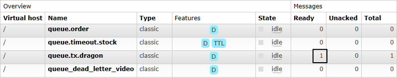

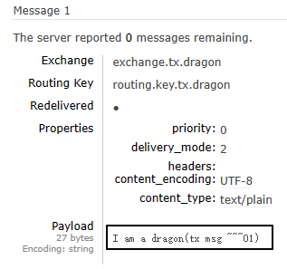

为了不影响后续操作，我们直接在管理界面这里把这条消息消费掉：


### 2、使用事务

#### ①说明

因为在junit中给测试方法使用@Transactional注解默认就会回滚，所以回滚操作需要使用@RollBack注解操控

#### ②测试提交事务的情况

```java
@Test
@Transactional
@Rollback(value = false)
public void testSendMessageInTx() {
    // 1、发送第一条消息
    rabbitTemplate.convertAndSend(EXCHANGE_NAME, ROUTING_KEY, "I am a dragon(tx msg [commit] ~~~01)");

    // 2、发送第二条消息
    rabbitTemplate.convertAndSend(EXCHANGE_NAME, ROUTING_KEY, "I am a dragon(tx msg [commit] ~~~02)");
}
```


#### ③测试回滚事务的情况

```java
@Test
@Transactional
@Rollback(value = true)
public void testSendMessageInTx() {
    // 1、发送第一条消息
    rabbitTemplate.convertAndSend(EXCHANGE_NAME, ROUTING_KEY, "I am a dragon(tx msg [rollback] ~~~01)");

    // 2、发送第二条消息
    rabbitTemplate.convertAndSend(EXCHANGE_NAME, ROUTING_KEY, "I am a dragon(tx msg [rollback] ~~~02)");
}
```


---

# 操作014：惰性队列

> 上一篇：[[Operation013-Tx-Producer]] · 下一篇：[[Operation015-PriorityQueue]]

## 一、创建惰性队列

### 1、官网说明


队列可以创建为`默认`或`惰性`模式，模式指定方式是：

- 使用队列策略（建议）
- 设置`queue.declare`参数

如果策略和队列参数同时指定，那么队列参数有更高优先级。如果队列模式是在声明时通过可选参数指定的，那么只能通过删除队列再重新创建来修改。

### 2、基于策略方式设定

```shell
# 登录Docker容器
docker exec -it rabbitmq /bin/bash

# 运行rabbitmqctl命令
rabbitmqctl set_policy Lazy "^lazy-queue$" '{"queue-mode":"lazy"}' --apply-to queues
```

命令解读：

- rabbitmqctl命令所在目录是：/opt/rabbitmq/sbin，该目录已配置到Path环境变量
- set_policy是子命令，表示设置策略
- Lazy是当前要设置的策略名称，是我们自己自定义的，不是系统定义的
- "^lazy-queue$"是用正则表达式限定的队列名称，凡是名称符合这个正则表达式的队列都会应用这里的设置
- '{"queue-mode":"lazy"}'是一个JSON格式的参数设置指定了队列的模式为"lazy"
- –-apply-to参数指定该策略将应用于队列（queues）级别

- 命令执行后，所有名称符合正则表达式的队列都会应用指定策略，包括未来新创建的队列

如果需要修改队列模式可以执行如下命令（不必删除队列再重建）：

```shell
rabbitmqctl set_policy Lazy "^lazy-queue$" '{"queue-mode":"default"}' --apply-to queues
```

### 3、在声明队列时使用参数设定

- 参数名称：x-queue-mode
- 可用参数值：
  - default
  - lazy
- 不设置就是取值为default

Java代码原生API设置方式：

```java
Map<String, Object> args = new HashMap<String, Object>();
args.put("x-queue-mode", "lazy");
channel.queueDeclare("myqueue", false, false, false, args);
```

Java代码注解设置方式：

```java
@Queue(value = QUEUE_NAME, durable = "true", autoDelete = "false", arguments = {
	@Argument(name = "x-queue-mode", value = "lazy")
})
```

## 二、实操演练

### 1、生产者端代码

#### ①配置POM

```xml
    <parent>
        <groupId>org.springframework.boot</groupId>
        <artifactId>spring-boot-starter-parent</artifactId>
        <version>3.1.5</version>
    </parent>

    <dependencies>
        <dependency>
            <groupId>org.springframework.boot</groupId>
            <artifactId>spring-boot-starter-amqp</artifactId>
        </dependency>
        <dependency>
            <groupId>org.springframework.boot</groupId>
            <artifactId>spring-boot-starter-test</artifactId>
        </dependency>
        <dependency>
            <groupId>org.projectlombok</groupId>
            <artifactId>lombok</artifactId>
        </dependency>
    </dependencies>
```

#### ②配置YAML

```yaml
spring:
  rabbitmq:
    host: 192.168.200.100
    port: 5672
    username: guest
    password: 123456
    virtual-host: /
```

#### ③主启动类

```java
package com.atguigu.mq;

import org.springframework.boot.SpringApplication;
import org.springframework.boot.autoconfigure.SpringBootApplication;

@SpringBootApplication
public class RabbitMQLazyProducer {

    public static void main(String[] args) {
        SpringApplication.run(RabbitMQLazyProducer.class, args);
    }

}
```

#### ④发送消息

```java
package com.atguigu.mq.test;

import jakarta.annotation.Resource;
import org.junit.jupiter.api.Test;
import org.springframework.amqp.rabbit.core.RabbitTemplate;
import org.springframework.boot.test.context.SpringBootTest;

@SpringBootTest
public class RabbitMQTest {

    public static final String EXCHANGE_LAZY_NAME = "exchange.atguigu.lazy";
    public static final String ROUTING_LAZY_KEY = "routing.key.atguigu.lazy";

    @Resource
    private RabbitTemplate rabbitTemplate;

    @Test
    public void testSendMessage() {
        rabbitTemplate.convertAndSend(EXCHANGE_LAZY_NAME, ROUTING_LAZY_KEY, "I am a message for test lazy queue.");
    }

}
```

### 2、消费者端代码

#### ①配置POM

```xml
    <parent>
        <groupId>org.springframework.boot</groupId>
        <artifactId>spring-boot-starter-parent</artifactId>
        <version>3.1.5</version>
    </parent>

    <dependencies>
        <dependency>
            <groupId>org.springframework.boot</groupId>
            <artifactId>spring-boot-starter-amqp</artifactId>
        </dependency>
        <dependency>
            <groupId>org.springframework.boot</groupId>
            <artifactId>spring-boot-starter-web</artifactId>
        </dependency>
        <dependency>
            <groupId>org.projectlombok</groupId>
            <artifactId>lombok</artifactId>
        </dependency>
    </dependencies>
```

#### ②配置YAML

```yaml
spring:
  rabbitmq:
    host: 192.168.200.100
    port: 5672
    username: guest
    password: 123456
    virtual-host: /
```

#### ③主启动类

```java
package com.atguigu.mq;

import org.springframework.boot.SpringApplication;
import org.springframework.boot.autoconfigure.SpringBootApplication;

@SpringBootApplication
public class RabbitMQLazyConsumerMainType {

    public static void main(String[] args) {
        SpringApplication.run(RabbitMQLazyConsumerMainType.class, args);
    }
    
}
```

#### ④监听器

```java
package com.atguigu.mq.listener;

import com.rabbitmq.client.Channel;
import lombok.extern.slf4j.Slf4j;
import org.springframework.amqp.core.Message;
import org.springframework.amqp.rabbit.annotation.*;
import org.springframework.stereotype.Component;

@Component
@Slf4j
public class MyLazyMessageProcessor {

    public static final String EXCHANGE_LAZY_NAME = "exchange.atguigu.lazy";
    public static final String ROUTING_LAZY_KEY = "routing.key.atguigu.lazy";
    public static final String QUEUE_LAZY_NAME = "queue.atguigu.lazy";

    @RabbitListener(bindings = @QueueBinding(
        value = @Queue(value = QUEUE_LAZY_NAME, durable = "true", autoDelete = "false", arguments = {
            @Argument(name = "x-queue-mode", value = "lazy")
        }),
        exchange = @Exchange(value = EXCHANGE_LAZY_NAME, durable = "true", autoDelete = "false"),
        key = {ROUTING_LAZY_KEY}
    ))
    public void processMessageLazy(String data, Message message, Channel channel) {
        log.info("消费端接收到消息：" + data);
    }

}
```

## 三、测试

- 先启动消费端

- 基于消费端@RabbitListener注解中的配置，自动创建了队列


- 发送消息


---

# 操作015：优先级队列

> 上一篇：[[Operation014-LazyQueue]] · 下一篇：[[Operation016-Cluster]]

## 一、创建相关资源

### 1、创建交换机

exchange.test.priority


### 2、创建队列

queue.test.priority

x-max-priority


### 3、队列绑定交换机


## 二、生产者发送消息

### 1、配置POM

```xml
<parent>
    <groupId>org.springframework.boot</groupId>
    <artifactId>spring-boot-starter-parent</artifactId>
    <version>3.1.5</version>
</parent>

<dependencies>
    <dependency>
        <groupId>org.springframework.boot</groupId>
        <artifactId>spring-boot-starter-amqp</artifactId>
    </dependency>
    <dependency>
        <groupId>org.springframework.boot</groupId>
        <artifactId>spring-boot-starter-test</artifactId>
    </dependency>
    <dependency>
        <groupId>org.projectlombok</groupId>
        <artifactId>lombok</artifactId>
    </dependency>
</dependencies>
```

### 2、配置YAML

```yaml
spring:
  rabbitmq:
    host: 192.168.200.100
    port: 5672
    username: guest
    password: 123456
    virtual-host: /
```

### 3、主启动类

```java
package com.atguigu.mq;

import org.springframework.boot.SpringApplication;
import org.springframework.boot.autoconfigure.SpringBootApplication;

@SpringBootApplication
public class RabbitMQPriorityProducer {

    public static void main(String[] args) {
        SpringApplication.run(RabbitMQPriorityProducer.class, args);
    }

}
```

### 4、发送消息

- 不要启动消费者程序，让多条不同优先级的消息滞留在队列中
- 第一次发送优先级为1的消息
- 第二次发送优先级为2的消息
- 第三次发送优先级为3的消息
- 先发送的消息优先级低，后发送的消息优先级高，将来看看消费端是不是先收到优先级高的消息

#### ①第一次发送优先级为1的消息

```java
package com.atguigu.mq.test;

import jakarta.annotation.Resource;
import org.junit.jupiter.api.Test;
import org.springframework.amqp.rabbit.core.RabbitTemplate;
import org.springframework.boot.test.context.SpringBootTest;

@SpringBootTest
public class RabbitMQTest {

    public static final String EXCHANGE_PRIORITY = "exchange.test.priority";
    public static final String ROUTING_KEY_PRIORITY = "routing.key.test.priority";

    @Resource
    private RabbitTemplate rabbitTemplate;

    @Test
    public void testSendMessage() {
        rabbitTemplate.convertAndSend(EXCHANGE_PRIORITY, ROUTING_KEY_PRIORITY, "I am a message with priority 1.", message->{
            message.getMessageProperties().setPriority(1);
            return message;
        });
    }

}
```

#### ②第二次发送优先级为2的消息

```java
@Test
public void testSendMessage() {
    rabbitTemplate.convertAndSend(EXCHANGE_PRIORITY, ROUTING_KEY_PRIORITY, "I am a message with priority 2.", message->{
        message.getMessageProperties().setPriority(2);
        return message;
    });
}
```

#### ③第三次发送优先级为3的消息

```java
@Test
public void testSendMessage() {
    rabbitTemplate.convertAndSend(EXCHANGE_PRIORITY, ROUTING_KEY_PRIORITY, "I am a message with priority 3.", message->{
        message.getMessageProperties().setPriority(3);
        return message;
    });
}
```


## 三、消费端接收消息

### 1、配置POM

```xml
<parent>
    <groupId>org.springframework.boot</groupId>
    <artifactId>spring-boot-starter-parent</artifactId>
    <version>3.1.5</version>
</parent>

<dependencies>
    <dependency>
        <groupId>org.springframework.boot</groupId>
        <artifactId>spring-boot-starter-amqp</artifactId>
    </dependency>
    <dependency>
        <groupId>org.springframework.boot</groupId>
        <artifactId>spring-boot-starter-web</artifactId>
    </dependency>
    <dependency>
        <groupId>org.projectlombok</groupId>
        <artifactId>lombok</artifactId>
    </dependency>
</dependencies>
```

### 2、配置YAML

```yaml
spring:
  rabbitmq:
    host: 192.168.200.100
    port: 5672
    username: guest
    password: 123456
    virtual-host: /
```

### 3、主启动类

```java
package com.atguigu.mq;

import org.springframework.boot.SpringApplication;
import org.springframework.boot.autoconfigure.SpringBootApplication;

@SpringBootApplication
public class RabbitMQPriorityConsumer {

    public static void main(String[] args) {
        SpringApplication.run(RabbitMQPriorityConsumer.class, args);
    }

}
```

### 4、监听器

```java
package com.atguigu.mq.listener;

import com.rabbitmq.client.Channel;
import lombok.extern.slf4j.Slf4j;
import org.springframework.amqp.core.Message;
import org.springframework.amqp.rabbit.annotation.*;
import org.springframework.stereotype.Component;

@Slf4j
@Component
public class MyMessageProcessor {

    public static final String QUEUE_PRIORITY = "queue.test.priority";

    @RabbitListener(queues = {QUEUE_PRIORITY})
    public void processPriorityMessage(String data, Message message, Channel channel) throws IOException {
        log.info(data);

        channel.basicAck(message.getMessageProperties().getDeliveryTag(), false);
    }

}
```

### 5、测试效果

对于已经滞留服务器的消息，只要消费端一启动，就能够收到消息队列的投递，打印效果如下：


---

# 操作016：集群搭建

> 上一篇：[[Operation015-PriorityQueue]] · 下一篇：[[Operation017-Quorum]]

## 一、安装RabbitMQ

### 1、前置要求

CentOS发行版的版本≥CentOS 8 Stream<br/>

镜像下载地址：https://mirrors.163.com/centos/8-stream/isos/x86_64/CentOS-Stream-8-20240318.0-x86_64-dvd1.iso

RabbitMQ安装方式官方指南：


### 2、安装Erlang环境

#### ①创建yum库配置文件

```shell
vim /etc/yum.repos.d/rabbitmq.repo
```

#### ②加入配置内容

以下内容来自官方文档：https://www.rabbitmq.com/docs/install-rpm

```properties
# In /etc/yum.repos.d/rabbitmq.repo

##
## Zero dependency Erlang RPM
##

[modern-erlang]
name=modern-erlang-el8
# uses a Cloudsmith mirror @ yum.novemberain.com in addition to its Cloudsmith upstream.
# Unlike Cloudsmith, the mirror does not have any traffic quotas
baseurl=https://yum1.novemberain.com/erlang/el/8/$basearch
        https://yum2.novemberain.com/erlang/el/8/$basearch
        https://dl.cloudsmith.io/public/rabbitmq/rabbitmq-erlang/rpm/el/8/$basearch
repo_gpgcheck=1
enabled=1
gpgkey=https://github.com/rabbitmq/signing-keys/releases/download/3.0/cloudsmith.rabbitmq-erlang.E495BB49CC4BBE5B.key
gpgcheck=1
sslverify=1
sslcacert=/etc/pki/tls/certs/ca-bundle.crt
metadata_expire=300
pkg_gpgcheck=1
autorefresh=1
type=rpm-md

[modern-erlang-noarch]
name=modern-erlang-el8-noarch
# uses a Cloudsmith mirror @ yum.novemberain.com.
# Unlike Cloudsmith, it does not have any traffic quotas
baseurl=https://yum1.novemberain.com/erlang/el/8/noarch
        https://yum2.novemberain.com/erlang/el/8/noarch
        https://dl.cloudsmith.io/public/rabbitmq/rabbitmq-erlang/rpm/el/8/noarch
repo_gpgcheck=1
enabled=1
gpgkey=https://github.com/rabbitmq/signing-keys/releases/download/3.0/cloudsmith.rabbitmq-erlang.E495BB49CC4BBE5B.key
       https://github.com/rabbitmq/signing-keys/releases/download/3.0/rabbitmq-release-signing-key.asc
gpgcheck=1
sslverify=1
sslcacert=/etc/pki/tls/certs/ca-bundle.crt
metadata_expire=300
pkg_gpgcheck=1
autorefresh=1
type=rpm-md

[modern-erlang-source]
name=modern-erlang-el8-source
# uses a Cloudsmith mirror @ yum.novemberain.com.
# Unlike Cloudsmith, it does not have any traffic quotas
baseurl=https://yum1.novemberain.com/erlang/el/8/SRPMS
        https://yum2.novemberain.com/erlang/el/8/SRPMS
        https://dl.cloudsmith.io/public/rabbitmq/rabbitmq-erlang/rpm/el/8/SRPMS
repo_gpgcheck=1
enabled=1
gpgkey=https://github.com/rabbitmq/signing-keys/releases/download/3.0/cloudsmith.rabbitmq-erlang.E495BB49CC4BBE5B.key
       https://github.com/rabbitmq/signing-keys/releases/download/3.0/rabbitmq-release-signing-key.asc
gpgcheck=1
sslverify=1
sslcacert=/etc/pki/tls/certs/ca-bundle.crt
metadata_expire=300
pkg_gpgcheck=1
autorefresh=1

##
## RabbitMQ Server
##

[rabbitmq-el8]
name=rabbitmq-el8
baseurl=https://yum2.novemberain.com/rabbitmq/el/8/$basearch
        https://yum1.novemberain.com/rabbitmq/el/8/$basearch
        https://dl.cloudsmith.io/public/rabbitmq/rabbitmq-server/rpm/el/8/$basearch
repo_gpgcheck=1
enabled=1
# Cloudsmith's repository key and RabbitMQ package signing key
gpgkey=https://github.com/rabbitmq/signing-keys/releases/download/3.0/cloudsmith.rabbitmq-server.9F4587F226208342.key
       https://github.com/rabbitmq/signing-keys/releases/download/3.0/rabbitmq-release-signing-key.asc
gpgcheck=1
sslverify=1
sslcacert=/etc/pki/tls/certs/ca-bundle.crt
metadata_expire=300
pkg_gpgcheck=1
autorefresh=1
type=rpm-md

[rabbitmq-el8-noarch]
name=rabbitmq-el8-noarch
baseurl=https://yum2.novemberain.com/rabbitmq/el/8/noarch
        https://yum1.novemberain.com/rabbitmq/el/8/noarch
        https://dl.cloudsmith.io/public/rabbitmq/rabbitmq-server/rpm/el/8/noarch
repo_gpgcheck=1
enabled=1
# Cloudsmith's repository key and RabbitMQ package signing key
gpgkey=https://github.com/rabbitmq/signing-keys/releases/download/3.0/cloudsmith.rabbitmq-server.9F4587F226208342.key
       https://github.com/rabbitmq/signing-keys/releases/download/3.0/rabbitmq-release-signing-key.asc
gpgcheck=1
sslverify=1
sslcacert=/etc/pki/tls/certs/ca-bundle.crt
metadata_expire=300
pkg_gpgcheck=1
autorefresh=1
type=rpm-md

[rabbitmq-el8-source]
name=rabbitmq-el8-source
baseurl=https://yum2.novemberain.com/rabbitmq/el/8/SRPMS
        https://yum1.novemberain.com/rabbitmq/el/8/SRPMS
        https://dl.cloudsmith.io/public/rabbitmq/rabbitmq-server/rpm/el/8/SRPMS
repo_gpgcheck=1
enabled=1
gpgkey=https://github.com/rabbitmq/signing-keys/releases/download/3.0/cloudsmith.rabbitmq-server.9F4587F226208342.key
gpgcheck=0
sslverify=1
sslcacert=/etc/pki/tls/certs/ca-bundle.crt
metadata_expire=300
pkg_gpgcheck=1
autorefresh=1
type=rpm-md
```

#### ③更新yum库

--nobest表示所需安装包即使不是最佳选择也接受

```shell
yum update -y --nobest
```

#### ④正式安装Erlang

```shell
yum install -y erlang
```

### 3、安装RabbitMQ

```shell
# 导入GPG密钥
rpm --import 'https://github.com/rabbitmq/signing-keys/releases/download/3.0/rabbitmq-release-signing-key.asc'
rpm --import 'https://github.com/rabbitmq/signing-keys/releases/download/3.0/cloudsmith.rabbitmq-erlang.E495BB49CC4BBE5B.key'
rpm --import 'https://github.com/rabbitmq/signing-keys/releases/download/3.0/cloudsmith.rabbitmq-server.9F4587F226208342.key'

# 下载 RPM 包
wget https://github.com/rabbitmq/rabbitmq-server/releases/download/v3.13.0/rabbitmq-server-3.13.0-1.el8.noarch.rpm

# 安装
rpm -ivh rabbitmq-server-3.13.0-1.el8.noarch.rpm
```

### 4、RabbitMQ基础配置

```shell
# 启用管理界面插件
rabbitmq-plugins enable rabbitmq_management

# 启动 RabbitMQ 服务：
systemctl start rabbitmq-server

# 将 RabbitMQ 服务设置为开机自动启动
systemctl enable rabbitmq-server

# 新增登录账号密码
rabbitmqctl add_user atguigu 123456

# 设置登录账号权限
rabbitmqctl set_user_tags atguigu administrator
rabbitmqctl set_permissions -p / atguigu ".*" ".*" ".*"

# 配置所有稳定功能 flag 启用
rabbitmqctl enable_feature_flag all

# 重启RabbitMQ服务生效
systemctl restart rabbitmq-server
```

### 5、收尾工作

```shell
rm -rf /etc/yum.repos.d/rabbitmq.repo
```

## 二、克隆VMWare虚拟机

### 1、目标

通过克隆操作，一共准备三台VMWare虚拟机

| 集群节点名称 | 虚拟机 IP 地址  |
| ------------ | --------------- |
| node01       | 192.168.200.100 |
| node02       | 192.168.200.150 |
| node03       | 192.168.200.200 |

### 2、克隆虚拟机


### 3、给新机设置 IP 地址

在CentOS 7中，可以使用`nmcli`命令行工具修改IP地址。以下是具体步骤：

1. 查看网络连接信息：
```shell
nmcli con show
```

2. 停止指定的网络连接（将`<connection_name>`替换为实际的网络连接名称）：
```shell
nmcli con down <connection_name>
```

3. 修改IP地址（将`<connection_name>`替换为实际的网络连接名称，将`<new_ip_address>`替换为新的IP地址，将`<subnet_mask>`替换为子网掩码，将`<gateway>`替换为网关）：
```shell
# <new_ip_address>/<subnet_mask>这里是 CIDR 表示法
nmcli con mod <connection_name> ipv4.addresses <new_ip_address>/<subnet_mask>
nmcli con mod <connection_name> ipv4.gateway <gateway>
nmcli con mod <connection_name> ipv4.method manual
```

4. 启动网络连接：
```shell
nmcli con up <connection_name>
```

5. 验证新的IP地址是否生效：
```shell
ip addr show
```

### 4、修改主机名称

主机名称会被RabbitMQ作为集群中的节点名称，后面会用到，所以需要设置一下。<br/>

修改方式如下：

```shell
vim /etc/hostname
```

### 5、保险措施

为了在后续操作过程中，万一遇到操作失误，友情建议拍摄快照。

## 三、集群节点彼此发现

### 1、node01设置

#### ①设置 IP 地址到主机名称的映射

修改文件/etc/hosts，追加如下内容：

```text
192.168.200.100 node01
192.168.200.150 node02
192.168.200.200 node03
```

#### ②查看当前RabbitMQ节点的Cookie值并记录

```shell
[root@node01 ~]# cat /var/lib/rabbitmq/.erlang.cookie 
NOTUPTIZIJONXDWWQPOJ
```

#### ③重置节点应用

```shell
rabbitmqctl stop_app
rabbitmqctl reset
rabbitmqctl start_app
```

### 2、node02设置

#### ①设置 IP 地址到主机名称的映射

修改文件/etc/hosts，追加如下内容：

```text
192.168.200.100 node01
192.168.200.150 node02
192.168.200.200 node03
```

#### ②修改当前RabbitMQ节点的Cookie值

node02和node03都改成和node01一样：

```shell
vim /var/lib/rabbitmq/.erlang.cookie
```

#### ③重置节点应用并加入集群

```shell
rabbitmqctl stop_app
rabbitmqctl reset
rabbitmqctl join_cluster rabbit@node01
rabbitmqctl start_app
```

### 3、node03设置

#### ①设置 IP 地址到主机名称的映射

修改文件/etc/hosts，追加如下内容：

```text
192.168.200.100 node01
192.168.200.150 node02
192.168.200.200 node03
```

#### ②修改当前RabbitMQ节点的Cookie值

node02和node03都改成和node01一样：

```shell
vim /var/lib/rabbitmq/.erlang.cookie
```

#### ③重置节点应用并加入集群

```shell
rabbitmqctl stop_app
rabbitmqctl reset
rabbitmqctl join_cluster rabbit@node01
rabbitmqctl start_app
```

#### ④查看集群状态

```shell
rabbitmqctl cluster_status
```


### 4、附录

如有需要踢出某个节点，则按下面操作执行：

```shell
# 被踢出的节点：
rabbitmqctl stop_app
rabbitmqctl reset
rabbitmqctl start_app

# 节点1
rabbitmqctl forget_cluster_node rabbit@node02
```

## 四、负载均衡：Management UI

### 1、说明

- 其实访问任何一个RabbitMQ实例的管理界面都是对集群操作，所以配置负载均衡通过统一入口访问在我们学习期间就是锦上添花
- 先给管理界面做负载均衡，然后方便我们在管理界面上创建交换机、队列等操作

### 2、安装HAProxy

```shell
yum install -y haproxy
haproxy -v
systemctl start haproxy
systemctl enable haproxy
```


### 3、修改配置文件

配置文件位置：

> /etc/haproxy/haproxy.cfg

在配置文件末尾增加如下内容：

> frontend rabbitmq_ui_frontend
> bind 192.168.200.100:22222
> mode http
> default_backend rabbitmq_ui_backend
>
> backend rabbitmq_ui_backend
> mode http
> balance roundrobin
> option httpchk GET /
> server rabbitmq_ui1 192.168.200.100:15672 check
> server rabbitmq_ui2 192.168.200.150:15672 check
> server rabbitmq_ui3 192.168.200.200:15672 check

设置SELinux策略，允许HAProxy拥有权限连接任意端口：

```shell
setsebool -P haproxy_connect_any=1
```

> SELinux是Linux系统中的安全模块，它可以限制进程的权限以提高系统的安全性。在某些情况下，SELinux可能会阻止HAProxy绑定指定的端口，这就需要通过设置域（domain）的安全策略来解决此问题。
>
> 通过执行`setsebool -P haproxy_connect_any=1`命令，您已经为HAProxy设置了一个布尔值，允许HAProxy连接到任意端口。这样，HAProxy就可以成功绑定指定的socket，并正常工作。
>

重启HAProxy：

```shell
systemctl restart haproxy
```

### 4、测试效果


## 五、负载均衡：核心功能

### 1、增加配置

> frontend rabbitmq_frontend
> bind 192.168.200.100:11111
> mode tcp
> default_backend rabbitmq_backend
>
> backend rabbitmq_backend
> mode tcp
> balance roundrobin
> server rabbitmq1 192.168.200.100:5672 check
> server rabbitmq2 192.168.200.150:5672 check
> server rabbitmq3 192.168.200.200:5672 check

重启HAProxy服务：

```shell
systemctl restart haproxy
```

### 3、测试

#### ①创建组件

- 交换机：exchange.cluster.test
- 队列：queue.cluster.test
- 路由键：routing.key.cluster.test

#### ②创建生产者端程序

##### [1]配置POM

```xml
<parent>
    <groupId>org.springframework.boot</groupId>
    <artifactId>spring-boot-starter-parent</artifactId>
    <version>3.1.5</version>
</parent>

<dependencies>
    <dependency>
        <groupId>org.springframework.boot</groupId>
        <artifactId>spring-boot-starter-amqp</artifactId>
    </dependency>
    <dependency>
        <groupId>org.springframework.boot</groupId>
        <artifactId>spring-boot-starter-test</artifactId>
    </dependency>
    <dependency>
        <groupId>org.projectlombok</groupId>
        <artifactId>lombok</artifactId>
    </dependency>
</dependencies>
```

##### [2]主启动类

```java
package com.atguigu.mq;  
  
import org.springframework.boot.SpringApplication;  
import org.springframework.boot.autoconfigure.SpringBootApplication;  
  
@SpringBootApplication
public class RabbitMQProducerMainType {

    public static void main(String[] args) {
        SpringApplication.run(RabbitMQProducerMainType.class, args);
    }

}
```

##### [3]配置YAML

```yaml
spring:
  rabbitmq:
    host: 192.168.200.100
    port: 11111
    username: atguigu
    password: 123456
    virtual-host: /
    publisher-confirm-type: CORRELATED # 交换机的确认
    publisher-returns: true # 队列的确认
logging:
  level:
    com.atguigu.mq.config.MQProducerAckConfig: info
```

##### [4]配置类

```java
package com.atguigu.mq.config;

import jakarta.annotation.PostConstruct;
import lombok.extern.slf4j.Slf4j;
import org.springframework.amqp.core.ReturnedMessage;
import org.springframework.amqp.rabbit.connection.CorrelationData;
import org.springframework.amqp.rabbit.core.RabbitTemplate;
import org.springframework.beans.factory.annotation.Autowired;
import org.springframework.context.annotation.Configuration;

@Configuration
@Slf4j
public class MQProducerAckConfig implements RabbitTemplate.ConfirmCallback, RabbitTemplate.ReturnsCallback{

    @Autowired
    private RabbitTemplate rabbitTemplate;

    @PostConstruct
    public void init() {
        rabbitTemplate.setConfirmCallback(this);
        rabbitTemplate.setReturnsCallback(this);
    }

    @Override
    public void confirm(CorrelationData correlationData, boolean ack, String cause) {
        if (ack) {
            log.info("消息发送到交换机成功！数据：" + correlationData);
        } else {
            log.info("消息发送到交换机失败！数据：" + correlationData + " 原因：" + cause);
        }
    }

    @Override
    public void returnedMessage(ReturnedMessage returned) {
        log.info("消息主体: " + new String(returned.getMessage().getBody()));
        log.info("应答码: " + returned.getReplyCode());
        log.info("描述：" + returned.getReplyText());
        log.info("消息使用的交换器 exchange : " + returned.getExchange());
        log.info("消息使用的路由键 routing : " + returned.getRoutingKey());
    }
}
```

##### [5] Junit测试类

```java
package com.atguigu.mq.test;

import jakarta.annotation.Resource;
import org.junit.jupiter.api.Test;
import org.springframework.amqp.rabbit.core.RabbitTemplate;
import org.springframework.boot.test.context.SpringBootTest;

@SpringBootTest
public class RabbitMQTest {

    @Resource
    private RabbitTemplate rabbitTemplate;

    public static final String EXCHANGE_CLUSTER_TEST = "exchange.cluster.test";
    public static final String ROUTING_KEY_CLUSTER_TEST = "routing.key.cluster.test";

    @Test
    public void testSendMessage() {
        rabbitTemplate.convertAndSend(EXCHANGE_CLUSTER_TEST, ROUTING_KEY_CLUSTER_TEST, "message test cluster~~~");
    }

}
```


#### ③创建消费端程序

##### [1]配置POM

```xml
<parent>
    <groupId>org.springframework.boot</groupId>
    <artifactId>spring-boot-starter-parent</artifactId>
    <version>3.1.5</version>
</parent>

<dependencies>
    <dependency>
        <groupId>org.springframework.boot</groupId>
        <artifactId>spring-boot-starter-amqp</artifactId>
    </dependency>
    <dependency>
        <groupId>org.springframework.boot</groupId>
        <artifactId>spring-boot-starter-web</artifactId>
    </dependency>
    <dependency>
        <groupId>org.projectlombok</groupId>
        <artifactId>lombok</artifactId>
    </dependency>
</dependencies>
```

##### [2]主启动类

```java
package com.atguigu.mq;  
  
import org.springframework.boot.SpringApplication;  
import org.springframework.boot.autoconfigure.SpringBootApplication;  
  
@SpringBootApplication
public class RabbitMQProducerMainType {

    public static void main(String[] args) {
        SpringApplication.run(RabbitMQProducerMainType.class, args);
    }

}
```

##### [3]配置YAML

```yaml
spring:
  rabbitmq:
    host: 192.168.200.100
    port: 11111
    username: atguigu
    password: 123456
    virtual-host: /
    listener:
      simple:
        acknowledge-mode: manual
logging:
  level:
    com.atguigu.mq.listener.MyProcessor: info
```

##### [4]监听器

```java
package com.atguigu.mq.listener;

import com.rabbitmq.client.Channel;
import lombok.extern.slf4j.Slf4j;
import org.springframework.amqp.core.Message;
import org.springframework.amqp.rabbit.annotation.RabbitListener;
import org.springframework.stereotype.Component;

import java.io.IOException;

@Component
@Slf4j
public class MyProcessor {

    @RabbitListener(queues = {"queue.cluster.test"})
    public void processNormalQueueMessage(String data, Message message, Channel channel) 
        throws IOException {
        
        log.info("消费端：" + data);

        channel.basicAck(message.getMessageProperties().getDeliveryTag(), false);
    }

}
```

##### [5]运行效果


## 六、镜像队列

### 1、提出问题

现在我们创建过的队列，它是属于节点1的：


现在我们停掉节点1的rabbit应用：

```shell
# 停止rabbit应用
rabbitmqctl stop_app
```


再次发送消息：


为了后续操作，再重新启动rabbit应用

```shell
rabbitmqctl start_app
```

### 2、创建策略使队列镜像化


### 3、创建新的队列

<span style="color:blue;font-weight:bolder;">要求</span>：队列名称必须符合策略中指定的正则表达式


绑定交换机：


### 4、测试

节点1关闭rabbit应用


然后就发现两个镜像队列自动分布到了节点2和节点3上：


调整Java代码中的组件名称：

```java
public static final String EXCHANGE_CLUSTER_TEST = "exchange.cluster.test";
public static final String ROUTING_KEY_MIRROR_TEST = "routing.key.mirror.test";
public static final String QUEUE_MIRROR_TEST = "mirror.queue.test";
```


---

# 操作017：仲裁队列

> 上一篇：[[Operation016-Cluster]] · 下一篇：[[Operation018-Stream]]

## 一、创建仲裁队列

> <span style="color:blue;font-weight:bolder;">说明</span>：鉴于仲裁队列的功能，肯定是需要在前面集群的基础上操作！

### 1、创建交换机

和仲裁队列绑定的交换机没有特殊，我们还是创建一个direct交换机即可

交换机名称：exchange.quorum.test


### 2、创建仲裁队列

队列名称：queue.quorum.test


### 3、绑定交换机

路由键：routing.key.quorum.test


## 二、测试仲裁队列

### 1、常规测试

像使用经典队列一样发送消息、消费消息

#### ①生产者端

```java
public static final String EXCHANGE_QUORUM_TEST = "exchange.quorum.test";
public static final String ROUTING_KEY_QUORUM_TEST = "routing.key.quorum.test";

@Test
public void testSendMessageToQuorum() {
    rabbitTemplate.convertAndSend(EXCHANGE_QUORUM_TEST, ROUTING_KEY_QUORUM_TEST, "message test quorum ~~~");
}
```


#### ②消费者端

```java
public static final String QUEUE_QUORUM_TEST = "queue.quorum.test";

@RabbitListener(queues = {QUEUE_QUORUM_TEST})
public void quorumMessageProcess(String data, Message message, Channel channel) throws IOException {
    log.info("消费端：" + data);
    channel.basicAck(message.getMessageProperties().getDeliveryTag(), false);
}
```


### 2、高可用测试

#### ①停止某个节点的rabbit应用

```shell
# 停止rabbit应用
rabbitmqctl stop_app
```

#### ②查看仲裁队列对应的节点情况


#### ③再次发送消息

收发消息仍然正常


---

# 操作018：Stream Queue

> 上一篇：[[Operation017-Quorum]] · 下一篇：[[Operation019-Federation]]

## 一、启用插件

> <span style="color:blue;font-weight:bolder;">说明</span>：只有启用了Stream插件，才能使用流式队列的完整功能

在集群每个节点中依次执行如下操作：

```shell
# 启用Stream插件
rabbitmq-plugins enable rabbitmq_stream

# 重启rabbit应用
rabbitmqctl stop_app
rabbitmqctl start_app

# 查看插件状态
rabbitmq-plugins list
```


## 二、负载均衡

在文件/etc/haproxy/haproxy.cfg末尾追加：

```text
frontend rabbitmq_stream_frontend
bind 192.168.200.100:33333
mode tcp
default_backend rabbitmq_stream_backend

backend rabbitmq_stream_backend
mode tcp
balance roundrobin
server rabbitmq1 192.168.200.100:5552 check
server rabbitmq2 192.168.200.150:5552 check
server rabbitmq3 192.168.200.200:5552 check
```

## 三、Java代码

### 1、引入依赖
Stream 专属 Java 客户端官方网址：https://github.com/rabbitmq/rabbitmq-stream-java-client

Stream 专属 Java 客户端官方文档网址：https://rabbitmq.github.io/rabbitmq-stream-java-client/stable/htmlsingle/

```xml
<dependencies>
    <dependency>
        <groupId>com.rabbitmq</groupId>
        <artifactId>stream-client</artifactId>
        <version>0.15.0</version>
    </dependency>

    <dependency>
        <groupId>org.slf4j</groupId>
        <artifactId>slf4j-api</artifactId>
        <version>1.7.30</version>
    </dependency>
    <dependency>
        <groupId>ch.qos.logback</groupId>
        <artifactId>logback-classic</artifactId>
        <version>1.2.3</version>
    </dependency>
</dependencies>
```

### 2、创建Stream

>  <span style="color:blue;font-weight:bolder;">说明</span>：不需要创建交换机

#### ①代码方式创建

```java
Environment environment = Environment.builder()
        .host("192.168.200.100")
        .port(33333)
        .username("atguigu")
        .password("123456")
        .build();

environment.streamCreator().stream("stream.atguigu.test2").create();

environment.close();
```

#### ②ManagementUI创建


### 3、生产者端程序

#### ①内部机制说明

##### [1]官方文档

> Internally, the `Environment` will query the broker to find out about the topology of the stream and will create or re-use a connection to publish to the leader node of the stream.

翻译：

> 在内部，Environment将查询broker以了解流的拓扑结构，并将创建或重用连接以发布到流的 leader 节点。

##### [2]解析

- 在 Environment 中封装的连接信息仅负责连接到 broker
- Producer 在构建对象时会访问 broker 拉取集群中 Leader 的连接信息
- 将来实际访问的是集群中的 Leader 节点
- Leader 的连接信息格式是：节点名称:端口号


##### [3]配置

为了让本机的应用程序知道 Leader 节点名称对应的 IP 地址，我们需要在本地配置 hosts 文件，建立从节点名称到 IP 地址的映射关系


#### ②示例代码

```java
Environment environment = Environment.builder()
        .host("192.168.200.100")
        .port(33333)
        .username("atguigu")
        .password("123456")
        .build();

Producer producer = environment.producerBuilder()
        .stream("stream.atguigu.test")
        .build();

byte[] messagePayload = "hello rabbit stream".getBytes(StandardCharsets.UTF_8);

CountDownLatch countDownLatch = new CountDownLatch(1);

producer.send(
        producer.messageBuilder().addData(messagePayload).build(),
        confirmationStatus -> {
            if (confirmationStatus.isConfirmed()) {
                System.out.println("[生产者端]the message made it to the broker");
            } else {
                System.out.println("[生产者端]the message did not make it to the broker");
            }

            countDownLatch.countDown();
        });

countDownLatch.await();

producer.close();

environment.close();
```

### 4、消费端程序

```java
Environment environment = Environment.builder()
        .host("192.168.200.100")
        .port(33333)
        .username("atguigu")
        .password("123456")
        .build();

environment.consumerBuilder()
        .stream("stream.atguigu.test")
        .name("stream.atguigu.test.consumer")
        .autoTrackingStrategy()
        .builder()
        .messageHandler((offset, message) -> {
            byte[] bodyAsBinary = message.getBodyAsBinary();
            String messageContent = new String(bodyAsBinary);
            System.out.println("[消费者端]messageContent = " + messageContent + " Offset=" + offset.offset());
        })
        .build();
```

## 四、指定偏移量消费

### 1、偏移量


### 2、官方文档说明

> The offset is the place in the stream where the consumer starts consuming from. The possible values for the offset parameter are the following:
>
> - OffsetSpecification.<span style="color:blue;font-weight:bolder;">first()</span>: starting from the first available offset. If the stream has not been [truncated](https://rabbitmq.github.io/rabbitmq-stream-java-client/stable/htmlsingle/#limiting-the-size-of-a-stream), this means the beginning of the stream (offset 0).
> - OffsetSpecification.<span style="color:blue;font-weight:bolder;">last()</span>: starting from the end of the stream and returning the last [chunk](https://rabbitmq.github.io/rabbitmq-stream-java-client/stable/htmlsingle/#chunk-definition) of messages immediately (if the stream is not empty).
> - OffsetSpecification.<span style="color:blue;font-weight:bolder;">next()</span>: starting from the next offset to be written. Contrary to `OffsetSpecification.last()`, consuming with `OffsetSpecification.next()` will not return anything if no-one is publishing to the stream. The broker will start sending messages to the consumer when messages are published to the stream.
> - OffsetSpecification.<span style="color:blue;font-weight:bolder;">offset(offset)</span>: starting from the specified offset. 0 means consuming from the beginning of the stream (first messages). The client can also specify any number, for example the offset where it left off in a previous incarnation of the application.
> - OffsetSpecification.<span style="color:blue;font-weight:bolder;">timestamp(timestamp)</span>: starting from the messages stored after the specified timestamp. Note consumers can receive messages published a bit before the specified timestamp. Application code can filter out those messages if necessary.

### 3、指定Offset消费

```java
Environment environment = Environment.builder()
        .host("192.168.200.100")
        .port(33333)
        .username("atguigu")
        .password("123456")
        .build();

CountDownLatch countDownLatch = new CountDownLatch(1);

Consumer consumer = environment.consumerBuilder()
        .stream("stream.atguigu.test")
        .offset(OffsetSpecification.first())
        .messageHandler((offset, message) -> {
            byte[] bodyAsBinary = message.getBodyAsBinary();
            String messageContent = new String(bodyAsBinary);
            System.out.println("[消费者端]messageContent = " + messageContent);
            countDownLatch.countDown();
        })
        .build();

countDownLatch.await();

consumer.close();
```

### 4、对比

- autoTrackingStrategy 方式：始终监听Stream中的新消息（狗狗看家，忠于职守）
- 指定偏移量方式：针对指定偏移量的消息消费之后就停止（狗狗叼飞盘，叼回来就完）


---

# 操作024：Federation插件

> 上一篇：[[Operation018-Stream]] · 下一篇：[[Operation020-Shovel]]

## 一、简介

Federation插件的设计目标是使RabbitMQ在不同的Broker节点之间进行消息传递而无须建立集群。

它可以在不同的管理域中的Broker或集群间传递消息，这些管理域可能设置了不同的用户和vhost，也可能运行在不同版本的RabbitMQ和Erlang上。Federation基于AMQP 0-9-1协议在不同的Broker之间进行通信，并且设计成能够容忍不稳定的网络连接情况。

## 二、Federation交换机

### 1、总体说明

- 各节点操作：启用联邦插件
- 下游操作：
  - 添加上游连接端点
  - 创建控制策略

### 2、准备工作

为了执行相关测试，我们使用Docker创建两个RabbitMQ实例。

<span style="color:blue;">**特别提示**</span>：由于Federation机制的最大特点就是跨集群同步数据，所以这两个Docker容器中的RabbitMQ实例不加入集群！！！是两个<span style="color:blue;">**独立的broker实例**</span>。

```shell
docker run -d \
--name rabbitmq-shenzhen \
-p 51000:5672 \
-p 52000:15672 \
-v rabbitmq-plugin:/plugins \
-e RABBITMQ_DEFAULT_USER=guest \
-e RABBITMQ_DEFAULT_PASS=123456 \
rabbitmq:3.13-management

docker run -d \
--name rabbitmq-shanghai \
-p 61000:5672 \
-p 62000:15672 \
-v rabbitmq-plugin:/plugins \
-e RABBITMQ_DEFAULT_USER=guest \
-e RABBITMQ_DEFAULT_PASS=123456 \
rabbitmq:3.13-management
```

### 3、启用联邦插件

在上游、下游节点中都需要开启。

Docker容器中的RabbitMQ已经开启了rabbitmq_federation，还需要开启rabbitmq_federation_management

```shell
rabbitmq-plugins enable rabbitmq_federation
rabbitmq-plugins enable rabbitmq_federation_management
```

rabbitmq_federation_management插件启用后会在Management UI的Admin选项卡下看到：


### 4、添加上游连接端点

在下游节点填写上游节点的连接信息：


### 5、创建控制策略


### 6、测试

#### ①测试计划

<span style="color:blue;">**特别提示**</span>：

- 普通交换机和联邦交换机名称要一致
- 交换机名称要能够和策略正则表达式匹配上
- 发送消息时，两边使用的路由键也要一致
- 队列名称不要求一致


#### ②创建组件

| 所在机房         | 交换机名称              | 路由键                | 队列名称              |
| ---------------- | ----------------------- | --------------------- | --------------------- |
| 深圳机房（上游） | federated.exchange.demo | routing.key.demo.test | queue.normal.shenzhen |
| 上海机房（下游） | federated.exchange.demo | routing.key.demo.test | queue.normal.shanghai |

创建组件后可以查看一下联邦状态，连接成功的联邦状态如下：


#### ③发布消息执行测试

在上游节点向交换机发布消息：


看到下游节点接收到了消息：


## 三、Federation队列

### 1、总体说明

Federation队列和Federation交换机的最核心区别就是：

- Federation Police作用在交换机上，就是Federation交换机
- Federation Police作用在队列上，就是Federation队列

### 2、创建控制策略


### 3、测试

#### ①测试计划

上游节点和下游节点中队列名称是相同的，只是下游队列中的节点附加了联邦策略而已

| 所在机房         | 交换机                   | 路由键                      | 队列           |
| ---------------- | ------------------------ | --------------------------- | -------------- |
| 深圳机房（上游） | exchange.normal.shenzhen | routing.key.normal.shenzhen | fed.queue.demo |
| 上海机房（下游） | ——                       | ——                          | fed.queue.demo |

#### ②创建组件

上游节点都是常规操作，此处省略。重点需要关注的是下游节点的联邦队列创建时需要指定相关参数：

创建组件后可以查看一下联邦状态，连接成功的联邦状态如下：


#### ③执行测试

在上游节点向交换机发布消息：


但此时发现下游节点中联邦队列并没有接收到消息，这是为什么呢？这里就体现出了联邦队列和联邦交换机工作逻辑的区别。

对联邦队列来说，如果没有监听联邦队列的消费端程序，它是不会到上游去拉取消息的！

如果有消费端监听联邦队列，那么首先消费联邦队列自身的消息；如果联邦队列为空，<span style="color:blue;">**这时候才**</span>会到上游队列节点中拉取消息。

所以现在的测试效果需要消费端程序配合才能看到：


---

# 操作025：Shovel

> 上一篇：[[Operation019-Federation]]

## 一、启用Shovel插件

```shell
rabbitmq-plugins enable rabbitmq_shovel
rabbitmq-plugins enable rabbitmq_shovel_management
```


## 二、配置Shovel


## 三、测试

### 1、测试计划

| 节点     | 交换机               | 路由键               | 队列                       |
| -------- | -------------------- | -------------------- | -------------------------- |
| 深圳节点 | exchange.shovel.test | exchange.shovel.test | queue.shovel.demo.shenzhen |
| 上海节点 | ——                   | ——                   | queue.shovel.demo.shanghai |

### 2、测试效果

#### ①发布消息


#### ②源节点


#### ③目标节点


